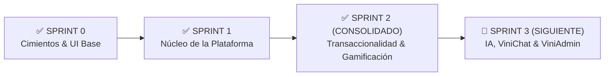
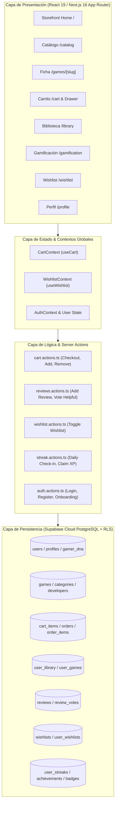

# 🎮 ViniGames — Plataforma E-Commerce Gamer & Comunidad

> **Plataforma Web de Comercio Electrónico Digital, Gamificación y Comunidad Gamer con Asistencia IA.**  
> Proyecto desarrollado para la carrera de **Ingeniería en Sistemas** — *Desarrollo de Aplicaciones Web*  
> **Universidad Tecnológica Privada de Santa Cruz (UTEPSA)** | Gestión 2026  
> **Docente Guía**: Ing. Bryana Ojopi Banegas  

---

## 📌 Estado del Proyecto & Sprints



* **✅ Sprint 0 (Setup & Fundaciones)**: Arquitectura Next.js 16 (App Router), Supabase SSR, DDL de 20 tablas relacionales con RLS, tokens de diseño Dark Gamer Figma y librería de primitivas UI modulares (`Button`, `Input`, `Badge`, `Card`, `Modal`).
* **✅ Sprint 1 (Núcleo de la Plataforma)**: Sistema de Autenticación Split-Screen con carrusel Ken Burns y cuentas Demo, Onboarding en 4 pasos con cálculo de **Gamer DNA**, Header persistente con widgets en vivo (Nivel/XP, GameCoins, Racha), Storefront Home, Catálogo multicriterio con búsqueda predictiva, Ficha técnica `/games/[slug]` y Perfil Gamer `/profile`.
* **✅ Sprint 2 (Transaccionalidad, Biblioteca, Reseñas & Gamificación — CONSOLIDADO)**:
  * 🛒 **Carrito & Checkout Transaccional**: Carrito reactivo con persistencia local/Supabase, Drawer lateral, modal de checkout simulado con validación Zod, generación de comprobante digital con código `TX-XXXX`, vaciado automático y transferencia instantánea a la biblioteca.
  * 📚 **Biblioteca Digital (`/library`)**: Catálogo personal de juegos adquiridos, filtros por estado (Todos, Instalados, Favoritos), acumulador en tiempo real de horas jugadas con simulador de ejecución "▶ Jugar" / "⏸ Detener".
  * ❤️ **Lista de Deseos Global (Wishlist)**: `WishlistProvider` global con reactividad inmediata, botón de corazón sincronizado en catálogo, ficha de juego y página `/wishlist`, con alertas de ofertas y cálculo de descuentos.
  * 🏆 **Hub de Gamificación (`/gamification`)**: Calendario interactivo de racha diaria de fuego, sistema de progresión de niveles ($\text{XP} \rightarrow \text{Nivel}$), vitrina de medallas/insignias desbloqueables y centro de recompensas canjeables con GameCoins.
  * ⭐ **Sistema de Reseñas y Calificaciones Verificadas**: Server Actions (`reviews.actions.ts`) con verificación de compra previa, cálculo ponderado de estrellas (1-5), formulario interactivo con feedback háptico y sistema de votación de utilidad ("¿Te resultó útil esta reseña?") con protección RLS.
* **⏳ Sprint 3 (Próximo)**: Asistente Virtual Gamer **ViniChat** con Inteligencia Artificial (Gemini API), Panel de Administración **ViniAdmin** (CRUD de catálogo, gestión de órdenes y analítica de usuarios) y personalización estética avanzada.

---

## 👥 Equipo de Desarrollo & Asignación de Módulos (Sprint 2)

| Integrante | Rol Principal | Módulos Implementados & Entregados (Sprint 2) | Rama de Integración |
| :--- | :--- | :--- | :--- |
| **Eduardo Ribera** | Líder Técnico & Backend | Sistema de Reseñas Verificadas, Votación de Utilidad, Políticas RLS, Middleware RBAC & Consolidación General | `feature/sprint-2-eduardo-reviews` |
| **Vinicius Montibeller** | Frontend Lead & E-Commerce | Carrito de Compras, Drawer Lateral, Checkout Simulado & Recibo Digital `TX-XXXX` | `feature/vinicius-cart-checkout` |
| **Sergio Alvarez** | Multimedia & Wishlist | Lista de Deseos (Wishlist Global), Sincronización en Catálogo/Detalle & Server Actions | `feature/sergio-wishlist` |
| **Shaimme Zelada** | Búsqueda & Biblioteca | Biblioteca Digital (`/library`), Acumulador de Horas Jugadas, Simulador "▶ Jugar" & Filtros | `feature/shaimme-catalog-filters` |
| **Jose Alberto Rios** | Gamificación & Perfil | Hub de Gamificación (`/gamification`), Calendario de Rachas, Galería de Medallas y Recompensas | `feature/jose-gamification-hub` |

---

## 🏗️ Arquitectura y Flujo del Sistema (Sprint 2)



---

## 🚀 Stack Tecnológico

| Capa / Subsistema | Tecnología | Versión | Rol y Justificación Técnica |
| :--- | :--- | :--- | :--- |
| **Framework Web** | [Next.js](https://nextjs.org/) (App Router) | `16.3.0` | Arquitectura híbrida RSC/SSR con aceleración Turbopack, compilación optimizada y Server Actions seguras. |
| **Librería de UI** | [React](https://react.dev/) | `19.2.8` | Componentes declarativos basados en el modelo de concurrencia y Server Actions. |
| **Motor de Estilos** | [Tailwind CSS](https://tailwindcss.com/) | `v4.0` | Tokens de Figma, paleta Dark Gamer (`#080A13`, `#131521`) con acentos neón violeta (`#783DF2`) y cian (`#1FD1EB`). |
| **Base de Datos & Auth** | [Supabase](https://supabase.com/) | PostgreSQL 15+ | Autenticación JWT (`@supabase/ssr`), 20 tablas relacionales, RLS perimetral y Storage. |
| **Validación de Datos** | [Zod](https://zod.dev/) | `^4.0` | Validación isomórfica de esquemas en cliente y servidor (formularios de checkout, login y reseñas). |
| **Efectos Visuales** | [Canvas Confetti](https://www.npmjs.com/package/canvas-confetti) | `^1.9.4` | Animaciones de celebración en bienvenida, logros desbloqueados y confirmación de compra. |
| **Iconografía** | [Lucide React](https://lucide.dev/) | `^1.33.0` | Iconos vectoriales consistentes para temáticas gamer, widgets y paneles. |
| **Lenguaje** | [TypeScript](https://www.typescriptlang.org/) | `^5.0` | Tipado estático estricto end-to-end con autogeneración de tipos de base de datos (`database.types.ts`). |
| **Motor de Gamificación** | Algoritmo Matemático Nativo | Custom | Progresión exponencial suave: $\text{XP} \rightarrow \text{Nivel}$, rachas diarias de fuego y balance de GameCoins. |

---

## 🗺️ Mapa de Rutas de la Aplicación (20 Rutas Compiladas)

```
vinigames/
├── (auth)/
│   ├── /login                     # Login Split-Screen con carrusel dinámico y cuentas Demo
│   ├── /register                  # Registro directo de credenciales
│   ├── /onboarding/               # Stepper de 4 pasos (Avatar, Géneros, Gamer DNA, Passport)
│   │   ├── /step-1                # Selección de Avatar y GamerTag
│   │   ├── /step-2                # Géneros y preferencias de juego
│   │   ├── /step-3                # Ponderación Gamer DNA (Radar interactivo)
│   │   └── /step-4                # Confirmación y Gamer Passport
│   └── /onboarding/welcome        # Pantalla festiva de bienvenida (Nivel 1 + 100 XP + 100 GameCoins)
├── (store)/
│   ├── /                          # Storefront Home (Hero Banner, lanzamientos y ofertas)
│   ├── /catalog                   # Catálogo general con filtros multicriterio y búsqueda predictiva
│   ├── /games                     # Redirección amigable al catálogo
│   ├── /games/[slug]              # Ficha técnica, galería de video/fotos, requisitos, compra y reseñas
│   ├── /cart                      # [Sprint 2] Carrito de compras, desglose de precios y Checkout
│   ├── /library                   # [Sprint 2] Biblioteca digital, contador de horas y simulador "Jugar"
│   ├── /wishlist                  # [Sprint 2] Lista de deseos reactiva con alertas de descuento
│   ├── /gamification              # [Sprint 2] Hub de rachas diarias, vitrina de medallas y recompensas
│   └── /profile                   # Perfil gamer, radar Gamer DNA y estadísticas históricas
├── /auth/callback                 # Endpoint OAuth / Supabase Auth Callback
└── /admin                         # [Sprint 3] Panel de administración ViniAdmin (Solo ADMIN)
```

---

## 📁 Estructura del Proyecto

```
vinigames/
├── app/                          # App Router (Next.js 16)
│   ├── (auth)/                   # Grupo de rutas de autenticación y onboarding
│   ├── (store)/                  # Grupo de rutas de tienda, catálogo, perfil, biblioteca, cart, gamification
│   │   ├── cart/                 # [Sprint 2] Vista de carrito y checkout
│   │   ├── catalog/              # Catálogo general y buscador
│   │   ├── games/[slug]/         # Ficha técnica, compra y reseñas
│   │   ├── gamification/         # [Sprint 2] Hub de gamificación y rachas
│   │   ├── library/              # [Sprint 2] Biblioteca de juegos del usuario
│   │   ├── profile/              # Perfil gamer
│   │   └── wishlist/             # [Sprint 2] Lista de deseos
│   ├── actions/                  # Server Actions seguras
│   │   ├── auth.actions.ts       # Autenticación, registro y onboarding
│   │   ├── cart.actions.ts       # [Sprint 2] Operaciones de carrito y checkout
│   │   ├── games.actions.ts      # Consultas y filtros de videojuegos
│   │   ├── reviews.actions.ts    # [Sprint 2] Reseñas verificadas y votos de utilidad
│   │   ├── streak.actions.ts     # [Sprint 2] Check-in diario de racha y premios XP
│   │   └── wishlist.actions.ts   # [Sprint 2] Gestión de lista de deseos
│   ├── auth/callback/            # Endpoint OAuth / Supabase Auth Callback
│   ├── globals.css               # Variables de tema Figma, fuentes y utilidades Dark Gamer
│   └── layout.tsx                # Layout raíz de la aplicación con fuentes Geist
├── components/                   # Componentes modulares y reutilizables
│   ├── layout/                   # Header persistente, Footer gamer y Widgets de estado en vivo
│   ├── store/                    # Catálogo, Buscador predictivo, Ficha de juego, Galería
│   │   ├── cart-drawer.tsx       # [Sprint 2] Drawer lateral desplegable del carrito
│   │   ├── checkout-modal.tsx    # [Sprint 2] Modal interactivo de checkout con recibo digital
│   │   ├── floating-buy-box.tsx  # Caja de compra flotante con botones de carrito y wishlist
│   │   ├── game-card.tsx         # Tarjeta de juego con badges, hover y botón de deseos
│   │   ├── predictive-search.tsx # Buscador reactivo con dropdown enriquecido
│   │   ├── review-form.tsx       # [Sprint 2] Formulario de reseña con estrellas interactivas
│   │   └── reviews-list.tsx      # [Sprint 2] Listado de opiniones y votación de utilidad
│   └── ui/                       # Primitivas UI (Badge, Button, Card, Input, Modal)
├── lib/                          # Capa de lógica de negocio y servicios
│   ├── context/                  # Context API (CartContext, WishlistContext, OnboardingContext)
│   ├── gamification/             # Fórmulas de XP, cálculo de niveles y progresión
│   ├── mock-data/                # Datasets de respaldo para desarrollo offline y fallback
│   ├── schemas/                  # Esquemas de validación Zod (auth, order, review)
│   ├── services/                 # Servicios desacoplados de datos (games, users, orders)
│   ├── supabase/                 # Clientes Supabase SSR (client, server, middleware)
│   └── utils.ts                  # Utilidades globales (cn = clsx + tailwind-merge)
├── types/                        # Definiciones TypeScript
│   ├── catalog.ts                # Interfaces del catálogo y filtros
│   ├── gamification.types.ts     # Tipos de rachas, logros y medallas
│   └── database.types.ts         # Tipos autogenerados de Supabase PostgreSQL
├── public/                       # Recursos estáticos, portadas e imágenes vectoriales
├── middleware.ts                 # Middleware Edge para refresco de sesión y control RBAC
└── package.json                  # Dependencias y scripts del proyecto
```

---

## 📦 Prerrequisitos e Instalación Local

### 1. Clonar el repositorio y navegar a la carpeta de la app:
```bash
git clone https://github.com/sergiam071105-ai/Vini-Games.git
cd Vini-Games/vinigames
```

### 2. Instalar dependencias del proyecto:
```bash
npm install
```

### 3. Configurar variables de entorno:
Crear el archivo `.env.local` a partir de `.env.example`:
```bash
cp .env.example .env.local
```

Configurar las credenciales correspondientes:
```env
NEXT_PUBLIC_SUPABASE_URL=https://rjtjzuvpdqnaxfenwsot.supabase.co
NEXT_PUBLIC_SUPABASE_ANON_KEY=tu_supabase_anon_key
NEXT_PUBLIC_SITE_URL=http://localhost:3000
```

### 4. Iniciar el entorno de desarrollo:
```bash
npm run dev
```
Abre [http://localhost:3000](http://localhost:3000) en tu navegador web.

---

## 🛠️ Scripts Disponibles

* `npm run dev`: Inicia el servidor de desarrollo local con Turbopack.
* `npm run build`: Compila la aplicación para producción optimizando las 20 rutas estáticas y dinámicas.
* `npm run start`: Inicia el servidor Next.js en modo de producción.
* `npm run lint`: Ejecuta el análisis estático de código con ESLint.

---

## 🌿 Flujo de Trabajo en Git (GitFlow / GitHub Flow)

* **`main`**: Rama principal de producción (despliegue productivo).
* **`develop`**: Rama de integración continua donde convergen las características aprobadas mediante Pull Request.
* **`feature/<integrante>-<funcionalidad>`**: Ramas de trabajo individuales para cada módulo.

### Convención de Commits Semánticos (Conventional Commits):
* `feat(modulo):` Nueva funcionalidad (ej: `feat(cart): agregar checkout modal`).
* `fix(modulo):` Corrección de errores (ej: `fix(auth): corregir refresco de token`).
* `docs:` Cambios en la documentación (ej: `docs: actualizar README y grafo para Sprint 2`).
* `style:` Ajustes visuales o de formato sin impacto en la lógica.
* `refactor:` Reestructuración de código sin alterar el comportamiento.
* `chore:` Tareas de mantenimiento, dependencias o configuración.

---

## 📄 Licencia y Uso Académico

Proyecto desarrollado con fines académicos en la **Universidad Tecnológica Privada de Santa Cruz (UTEPSA)** bajo la supervisión docente de la **Ing. Bryana Ojopi Banegas**.

