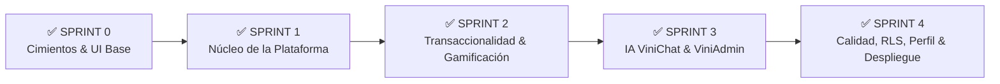
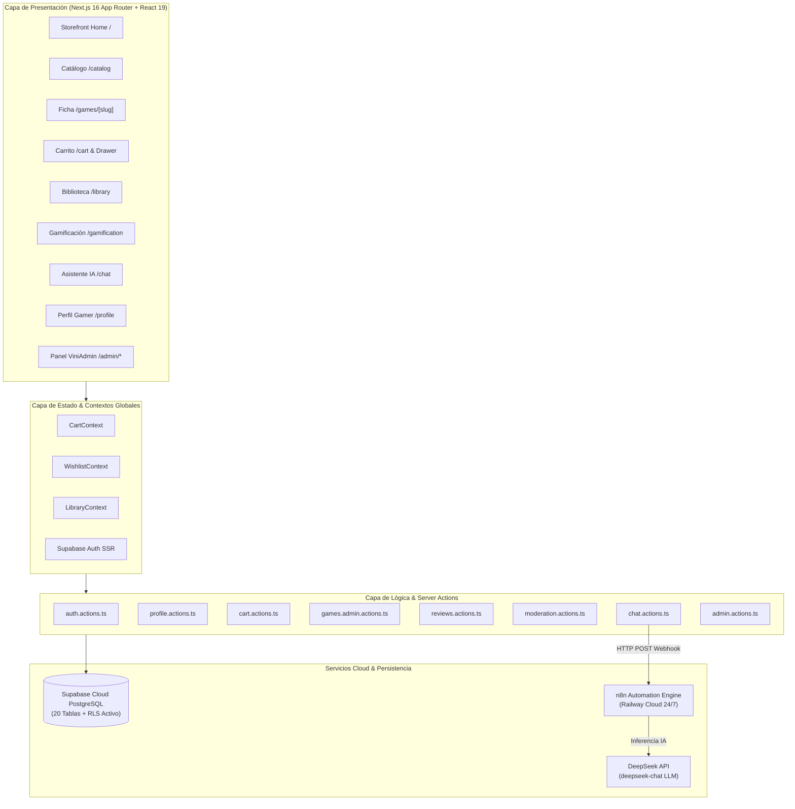

# 🎮 ViniGames — Plataforma E-Commerce Gamer, Gamificación & Asistencia IA

> **Plataforma Web Integral de Comercio Electrónico Digital, Gamificación, Moderación Comunitaria y Asistencia Virtual Gamer impulsada por Inteligencia Artificial.**  
> Proyecto desarrollado para la carrera de **Ingeniería en Sistemas** — *Desarrollo de Aplicaciones Web*  
> **Universidad Tecnológica Privada de Santa Cruz (UTEPSA)** | Gestión 2026  
> **Docente Guía**: Ing. Bryana Ojopi Banegas  

---

## 📌 Estado del Proyecto & Cronograma de Sprints



* **✅ Sprint 0 (Setup & Fundaciones)**: Arquitectura Next.js 16 (App Router) con Turbopack, Supabase SSR, DDL de 20 tablas relacionales con RLS, tokens de diseño Dark Gamer Figma y librería de primitivas UI modulares (`Button`, `Input`, `Badge`, `Card`, `Modal`).
* **✅ Sprint 1 (Núcleo de la Plataforma)**: Sistema de Autenticación Split-Screen, Onboarding en 4 pasos con cálculo de **Gamer DNA** (Explorador, Competitivo, Narrativo, Coleccionista), Header persistente con widgets en vivo (Nivel/XP, GameCoins, Racha), Storefront Home, Catálogo multicriterio con búsqueda predictiva y Ficha técnica `/games/[slug]`.
* **✅ Sprint 2 (Transaccionalidad, Biblioteca, Reseñas & Gamificación)**:
  * 🛒 **Carrito & Checkout Transaccional**: Carrito reactivo, Drawer lateral, modal de checkout con validación Zod, emisión de recibo digital con código `TX-XXXX`, vaciado automático y transferencia instantánea a la biblioteca.
  * 📚 **Biblioteca Digital (`/library`)**: Catálogo personal de juegos adquiridos con filtros por estado y acumulador en tiempo real de horas jugadas mediante simulador de ejecución ("▶ Jugar" / "⏸ Detener").
  * ❤️ **Lista de Deseos Global (Wishlist)**: `WishlistProvider` con sincronización en tiempo real en catálogo, ficha técnica y `/wishlist`, con alertas de ofertas y cálculo de descuentos.
  * 🏆 **Hub de Gamificación (`/gamification`)**: Calendario interactivo de racha diaria de 7 días, progresión de niveles ($\text{XP} \rightarrow \text{Nivel}$), vitrina de medallas/insignias por rareza y centro de recompensas canjeables con GameCoins.
  * ⭐ **Sistema de Reseñas Verificadas**: Server Actions (`reviews.actions.ts`) con validación de compra obligatoria, puntuación de 1 a 5 estrellas (+50 XP y +25 GameCoins) y sistema de votación comunitaria de utilidad (`👍` / `👎`).
* **✅ Sprint 3 (Inteligencia Artificial ViniChat & Panel Administrativo ViniAdmin)**:
  * 🤖 **Asistente IA ViniChat (`/chat`)**: Despliegue de workflow en **n8n Cloud (Railway)** conectado al modelo **`deepseek-chat`** de DeepSeek, enriquecimiento con Gamer DNA y biblioteca, renderizado de tarjetas interactivas de producto y sidebar colapsable.
  * 🛡️ **Panel Administrativo de Catálogo (`/admin/games`)**: CRUD completo de títulos, cálculo automático de precios/ofertas y sistema de **baja lógica** (`is_active = false`) con persistencia inmediata.
  * ⚖️ **Moderación Comunitaria (`/admin/reviews`)**: Cola de moderación con filtros por estado (*Todas, Pendientes, Aprobadas, Rechazadas*), contadores reactivos y registro de auditoría en `admin_audit_logs`.
  * 📊 **Auditoría Financiera (`/admin/sales`)**: Reporte de órdenes de compra con métricas de ventas y utilidad de **exportación a archivo CSV**.
* **✅ Sprint 4 (Calidad, Auditoría RLS, Perfil Gamer Dinámico, Limpieza de Producción & Despliegue)**:
  * 🔒 **Auditoría y Endurecimiento Integral de RLS**: Políticas de seguridad a nivel de filas aplicadas en Supabase Cloud para las 20 tablas de PostgreSQL.
  * 👤 **Perfil Gamer Dinámico (`/profile`)**: Conexión completa a Supabase con cálculo de Nivel/XP, 4 pestañas interactivas (*Mis Juegos, Logros, Reseñas, Recompensas*), visualizador de Gamer DNA y modal de edición de perfil (`EditProfileModal`).
  * 🧹 **Limpieza y Pulido de Producción**: Eliminación de datos quemados en checkout y login, unificación estricta de moneda en Bolivianos (`Bs.`), redirección al cerrar sesión hacia `/login` y redirección limpia de `/games` a `/catalog`.
  * 🧪 **Calidad y Rendimiento**: 0 errores de TypeScript (`npx tsc --noEmit`) y compilación Next.js Turbopack de las **26 rutas en 4.7 segundos**.

---

## 👥 Equipo de Desarrollo & Asignación de Roles

| Integrante | Rol Principal | Módulos y Responsabilidades | Rama de Integración |
| :--- | :--- | :--- | :--- |
| **Eduardo Ribera** | Líder Técnico & Backend / Seguridad | Arquitectura ViniChat con n8n Cloud & DeepSeek API, Auditoría de Seguridad RLS en Supabase, Perfil Gamer Dinámico, Consolidación General y Despliegue | `feature/eduardo-sprint-4-profile-polish` |
| **Vinicius Montibeller** | Frontend Lead & E-Commerce | Storefront Home, Carrito & Checkout, Layout ViniAdmin, Modales y CRUD de Catálogo con Baja Lógica | `feature/vinicius-sprint-4-quality-polish` |
| **Sergio Alvarez** | Multimedia & Transacciones | Ficha Técnica `/games/[slug]`, Wishlist, Auditoría Comercial `/admin/sales`, Exportación CSV y Accesibilidad | `feature/sergio-sprint-4-audit-responsive-a11y` |
| **Jose Alberto Rios** | Gamificación & Moderación | Hub de Gamificación, Radar Gamer DNA, Moderación de Reseñas `/admin/reviews` y Seed Data Demo | `feature/jose-sprint-4-demo-validation` |

---

## 🏗️ Arquitectura y Flujo Integral del Sistema



---

## 🚀 Stack Tecnológico

| Capa / Subsistema | Tecnología | Versión | Rol y Justificación Técnica |
| :--- | :--- | :--- | :--- |
| **Framework Web** | [Next.js](https://nextjs.org/) (App Router) | `16.3.0` | Arquitectura híbrida RSC/SSR con aceleración Turbopack, compilación optimizada y Server Actions seguras. |
| **Librería de UI** | [React](https://react.dev/) | `19.2.8` | Componentes declarativos basados en el modelo de concurrencia y Server Actions. |
| **Motor de Estilos** | [Tailwind CSS](https://tailwindcss.com/) | `v4.0` | Tokens de Figma, paleta Dark Gamer (`#090B14`, `#131521`) con acentos neón violeta (`#783DF2`) y cian (`#1FD1EB`). |
| **Base de Datos & Auth** | [Supabase](https://supabase.com/) | PostgreSQL 15+ | Autenticación JWT (`@supabase/ssr`), 20 tablas relacionales, RLS perimetral y Storage. |
| **Motor de IA & Webhook** | [n8n](https://n8n.io/) + [DeepSeek API](https://www.deepseek.com/) | Cloud / `v1` | Motor de automatización en Railway Cloud con inferencia LLM (`deepseek-chat`) para el asistente ViniChat. |
| **Validación de Datos** | [Zod](https://zod.dev/) | `^4.0` | Validación isomórfica de esquemas en cliente y servidor (formularios de checkout, login, chat y catálogo). |
| **Efectos Visuales** | [Canvas Confetti](https://www.npmjs.com/package/canvas-confetti) | `^1.9.4` | Animaciones de celebración en bienvenida, logros desbloqueados y confirmación de compra. |
| **Iconografía** | [Lucide React](https://lucide.dev/) | `^1.33.0` | Iconos vectoriales consistentes para temáticas gamer, widgets y paneles. |
| **Lenguaje** | [TypeScript](https://www.typescriptlang.org/) | `^5.0` | Tipado estático estricto end-to-end con autogeneración de tipos de base de datos. |
| **Plataforma de Despliegue** | [Vercel](https://vercel.com/) + [Railway](https://railway.app/) | Cloud | Despliegue continuo de frontend en Vercel y microservicio de IA n8n en Railway. |

---

## 🗺️ Mapa de Rutas de la Aplicación (26 Rutas Compiladas)

```
vinigames/
├── (auth)/
│   ├── /login                     # Login Split-Screen con carrusel dinámico y redirección segura
│   ├── /register                  # Registro directo de credenciales
│   ├── /onboarding/               # Stepper de 4 pasos (Avatar, Géneros, Gamer DNA, Passport)
│   │   ├── /step-1                # Selección de Avatar y GamerTag
│   │   ├── /step-2                # Géneros y preferencias de juego
│   │   ├── /step-3                # Ponderación Gamer DNA (Radar interactivo)
│   │   └── /step-4                # Confirmación y Gamer Passport
│   └── /onboarding/welcome        # Pantalla festiva de bienvenida (Nivel 1 + 100 XP + 100 GameCoins)
├── (store)/
│   ├── /                          # Storefront Home (Hero Banner, lanzamientos y ofertas en Bs.)
│   ├── /catalog                   # Catálogo general con filtros multicriterio y búsqueda predictiva
│   ├── /games                     # Redirección amigable al catálogo oficial
│   ├── /games/[slug]              # Ficha técnica, galería de video/fotos, requisitos, compra y reseñas
│   ├── /cart                      # Carrito de compras, desglose de precios y Checkout seguro
│   ├── /library                   # Biblioteca digital, contador de horas y simulador "▶ Jugar"
│   ├── /wishlist                  # Lista de deseos reactiva con alertas de descuento
│   ├── /gamification              # Hub de rachas diarias, vitrina de medallas y recompensas
│   ├── /chat                      # Asistente IA ViniChat (DeepSeek + n8n Cloud)
│   └── /profile                   # Perfil gamer dinámico, radar Gamer DNA, logros y edición
├── /admin                         # Dashboard General de Administración (RBAC: ADMIN)
│   ├── /admin/games               # Catálogo Administrativo (CRUD & Baja Lógica)
│   ├── /admin/games/new           # Formulario de Alta de Nuevos Videojuegos
│   ├── /admin/games/[id]/edit     # Formulario de Edición de Videojuegos
│   ├── /admin/reviews             # Cola de Moderación de Reseñas Comunitarias
│   └── /admin/sales               # Auditoría Transaccional y Exportación CSV
└── /auth/callback                 # Endpoint OAuth / Supabase Auth Callback
```

---

## 🔒 Seguridad & Políticas Row Level Security (RLS)

El acceso a los datos de las 20 entidades de PostgreSQL está regido por políticas RLS idempotentes:
1. **`profiles`:** Lectura pública de niveles y avatares; edición restringida exclusivamente al dueño (`auth.uid() = id`) o administrador.
2. **`games`:** Clientes solo leen títulos activos (`is_active = true`); administradores gestionan CRUD completo y bajas lógicas.
3. **`cart_items` y `wishlists`:** Aislamiento estricto por usuario (`auth.uid() = user_id`).
4. **`orders` y `order_items`:** Visualización privada de compras para el cliente y auditoría para administradores.
5. **`reviews` y `review_votes`:** La tienda pública solo muestra opiniones aprobadas (`status = 'APPROVED'`).
6. **`chat_sessions` y `chat_messages`:** Aislamiento de conversaciones con el asistente virtual.
7. **`admin_audit_logs`:** Acceso restringido exclusivamente a usuarios con rol `ADMIN`.
