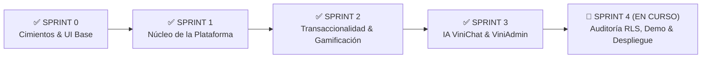
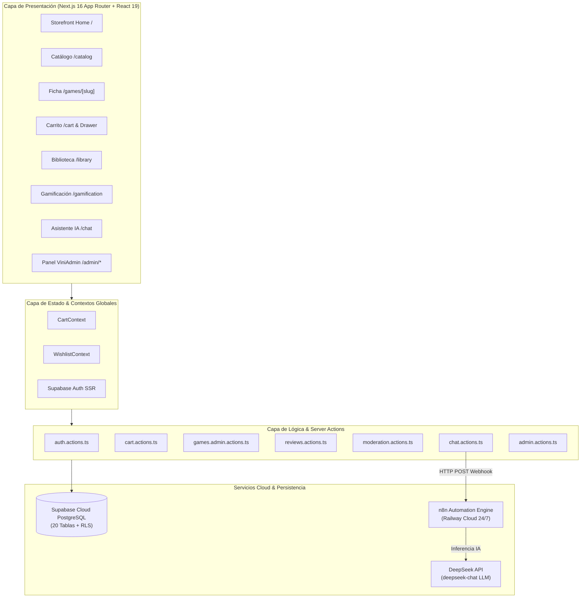

# 🎮 ViniGames — Plataforma E-Commerce Gamer, Gamificación & Asistencia IA

> **Plataforma Web Integral de Comercio Electrónico Digital, Gamificación, Moderación Comunitaria y Asistencia Virtual Gamer impulsada por Inteligencia Artificial.**  
> Proyecto desarrollado para la carrera de **Ingeniería en Sistemas** — *Desarrollo de Aplicaciones Web*  
> **Universidad Tecnológica Privada de Santa Cruz (UTEPSA)** | Gestión 2026  
> **Docente Guía**: Ing. Bryana Ojopi Banegas  

---

## 📌 Estado del Proyecto & Cronograma de Sprints



* **✅ Sprint 0 (Setup & Fundaciones)**: Arquitectura Next.js 16 (App Router) con Turbopack, Supabase SSR, DDL de 20 tablas relacionales con RLS, tokens de diseño Dark Gamer Figma y librería de primitivas UI modulares (`Button`, `Input`, `Badge`, `Card`, `Modal`).
* **✅ Sprint 1 (Núcleo de la Plataforma)**: Sistema de Autenticación Split-Screen con cuentas Demo, Onboarding en 4 pasos con cálculo de **Gamer DNA** (Explorador, Competitivo, Narrativo, Coleccionista), Header persistente con widgets en vivo (Nivel/XP, GameCoins, Racha de fuego), Storefront Home, Catálogo multicriterio con búsqueda predictiva, Ficha técnica `/games/[slug]` y Perfil Gamer `/profile`.
* **✅ Sprint 2 (Transaccionalidad, Biblioteca, Reseñas & Gamificación)**:
  * 🛒 **Carrito & Checkout Transaccional**: Carrito reactivo, Drawer lateral, modal de checkout simulado con validación Zod, emisión de recibo digital con código `TX-XXXX`, vaciado automático y transferencia instantánea a la biblioteca.
  * 📚 **Biblioteca Digital (`/library`)**: Catálogo personal de juegos adquiridos con filtros por estado y acumulador en tiempo real de horas jugadas mediante simulador de ejecución ("▶ Jugar" / "⏸ Detener").
  * ❤️ **Lista de Deseos Global (Wishlist)**: `WishlistProvider` con sincronización en tiempo real en catálogo, ficha técnica y `/wishlist`, con alertas de ofertas y cálculo de descuentos.
  * 🏆 **Hub de Gamificación (`/gamification`)**: Calendario interactivo de racha diaria de 7 días, progresión de niveles ($\text{XP} \rightarrow \text{Nivel}$), vitrina de medallas/insignias por rareza y centro de recompensas canjeables con GameCoins.
  * ⭐ **Sistema de Reseñas Verificadas**: Server Actions (`reviews.actions.ts`) con validación de compra obligatoria, puntuación de 1 a 5 estrellas (+50 XP y +25 GameCoins) y sistema de votación comunitaria de utilidad (`👍` / `👎`).
* **✅ Sprint 3 (Inteligencia Artificial ViniChat & Panel Administrativo ViniAdmin)**:
  * 🤖 **Asistente IA ViniChat (`/chat`)**: Despliegue de workflow en **n8n Cloud (Railway)** conectado al modelo **`deepseek-chat`** de DeepSeek, enriquecimiento con Gamer DNA y biblioteca, renderizado de tarjetas interactivas de producto y sidebar colapsable.
  * 🛡️ **Panel Administrativo de Catálogo (`/admin/games`)**: CRUD completo de títulos, cálculo automático de precios/ofertas y sistema de **baja lógica** (`is_active = false`) con persistencia inmediata.
  * ⚖️ **Moderación Comunitaria (`/admin/reviews`)**: Cola de moderación con filtros por estado (*Todas, Pendientes, Aprobadas, Rechazadas*), contadores reactivos y registro de auditoría en `admin_audit_logs`.
  * 📊 **Auditoría Financiera (`/admin/sales`)**: Reporte de órdenes de compra con métricas de ventas y utilidad de **exportación a archivo CSV**.
* **🚀 Sprint 4 (Calidad, Auditoría RLS, Demo Seed Data & Despliegue en Producción — EN CURSO)**:
  * 🔒 **Auditoría Integral de RLS**: Revisión y endurecimiento de políticas de seguridad en Supabase PostgreSQL para las 20 tablas.
  * 🎮 **Seed Data de Demostración**: Catálogo robusto con más de 12 videojuegos completos, carátulas HD y géneros asociados.
  * 📱 **Pruebas de Responsividad & Accesibilidad**: Optimización Mobile-First y cumplimiento de estándares WCAG 2.1 AA.
  * 🌐 **Despliegue Continuo en Vercel**: Paso a producción conectado con Supabase Cloud y Railway.

---

## 👥 Equipo de Desarrollo & Asignación de Roles

| Integrante | Rol Principal | Módulos y Responsabilidades (Sprint 3 & 4) | Rama de Integración |
| :--- | :--- | :--- | :--- |
| **Eduardo Ribera** | Líder Técnico & Backend | Arquitectura ViniChat con n8n Cloud & DeepSeek API, Auditoría de Seguridad RLS en Supabase, Consolidación General y Despliegue | `feature/eduardo-sprint-4-quality-deploy` |
| **Vinicius Montibeller** | Frontend Lead & E-Commerce | Storefront Home, Carrito & Checkout Simulado, Layout ViniAdmin y CRUD de Catálogo con Baja Lógica | `feature/vinicius-sprint-3-chat-admin` |
| **Sergio Alvarez** | Multimedia & Transacciones | Ficha Técnica `/games/[slug]`, Wishlist, Auditoría Comercial `/admin/sales` y Exportación CSV | `feature/sergio-admin-sales` |
| **Jose Alberto Rios** | Gamificación & Moderación | Hub de Gamificación, Radar Gamer DNA, Moderación de Reseñas `/admin/reviews` y Seed Data Demo | `feature/jose-sprint-3-admin-moderation` |
| **Shaimme Zelada** | Catálogo & Biblioteca | Catálogo General `/catalog`, Filtros Multicriterio, Búsqueda Predictiva y Biblioteca Digital `/library` | `feature/shaimme-catalog-filters` |

---

## 🏗️ Arquitectura y Flujo Integral del Sistema



---

## 🚀 Stack Tecnológico

| Capa / Subsistema | Tecnología | Versión | Rol y Justificación Técnica |
| :--- | :--- | :--- | :--- |
| **Framework Web** | [Next.js](https://nextjs.org/) (App Router) | `16.3.0` | Arquitectura híbrida RSC/SSR con aceleración Turbopack, compilación optimizada y Server Actions seguras. |
| **Librería de UI** | [React](https://react.dev/) | `19.2.8` | Componentes declarativos basados en el modelo de concurrencia y Server Actions. |
| **Motor de Estilos** | [Tailwind CSS](https://tailwindcss.com/) | `v4.0` | Tokens de Figma, paleta Dark Gamer (`#090B14`, `#131521`) con acentos neón violeta (`#783DF2`) y cian (`#1FD1EB`). |
| **Base de Datos & Auth** | [Supabase](https://supabase.com/) | PostgreSQL 15+ | Autenticación JWT (`@supabase/ssr`), 20 tablas relacionales, RLS perimetral y Storage. |
| **Motor de IA & Webhook** | [n8n](https://n8n.io/) + [DeepSeek API](https://www.deepseek.com/) | Cloud / `v1` | Motor de automatización en Railway Cloud con inferencia LLM (`deepseek-chat`) para el asistente ViniChat. |
| **Validación de Datos** | [Zod](https://zod.dev/) | `^4.0` | Validación isomórfica de esquemas en cliente y servidor (formularios de checkout, login, chat y catálogo). |
| **Efectos Visuales** | [Canvas Confetti](https://www.npmjs.com/package/canvas-confetti) | `^1.9.4` | Animaciones de celebración en bienvenida, logros desbloqueados y confirmación de compra. |
| **Iconografía** | [Lucide React](https://lucide.dev/) | `^1.33.0` | Iconos vectoriales consistentes para temáticas gamer, widgets y paneles. |
| **Lenguaje** | [TypeScript](https://www.typescriptlang.org/) | `^5.0` | Tipado estático estricto end-to-end con autogeneración de tipos de base de datos. |
| **Plataforma de Despliegue** | [Vercel](https://vercel.com/) + [Railway](https://railway.app/) | Cloud | Despliegue continuo de frontend en Vercel y microservicio de IA n8n en Railway. |

---

## 🗺️ Mapa de Rutas de la Aplicación (26 Rutas Compiladas)

```
vinigames/
├── (auth)/
│   ├── /login                     # Login Split-Screen con carrusel dinámico y cuentas Demo
│   ├── /register                  # Registro directo de credenciales
│   ├── /onboarding/               # Stepper de 4 pasos (Avatar, Géneros, Gamer DNA, Passport)
│   │   ├── /step-1                # Selección de Avatar y GamerTag
│   │   ├── /step-2                # Géneros y preferencias de juego
│   │   ├── /step-3                # Ponderación Gamer DNA (Radar interactivo)
│   │   └── /step-4                # Confirmación y Gamer Passport
│   └── /onboarding/welcome        # Pantalla festiva de bienvenida (Nivel 1 + 100 XP + 100 GameCoins)
├── (store)/
│   ├── /                          # Storefront Home (Hero Banner, lanzamientos y ofertas)
│   ├── /catalog                   # Catálogo general con filtros multicriterio y búsqueda predictiva
│   ├── /games                     # Redirección amigable al catálogo
│   ├── /games/[slug]              # Ficha técnica, galería de video/fotos, requisitos, compra y reseñas
│   ├── /cart                      # Carrito de compras, desglose de precios y Checkout simulado
│   ├── /library                   # Biblioteca digital, contador de horas y simulador "▶ Jugar"
│   ├── /wishlist                  # Lista de deseos reactiva con alertas de descuento
│   ├── /gamification              # Hub de rachas diarias, vitrina de medallas y recompensas
│   ├── /chat                      # [Sprint 3] Asistente IA ViniChat (DeepSeek + n8n Cloud)
│   └── /profile                   # Perfil gamer, radar Gamer DNA y estadísticas históricas
├── /admin                         # [Sprint 3] Dashboard General de Administración (RBAC: ADMIN)
│   ├── /admin/games               # [Sprint 3] Catálogo Administrativo (CRUD & Baja Lógica)
│   ├── /admin/games/new           # [Sprint 3] Formulario de Alta de Nuevos Videojuegos
│   ├── /admin/games/[id]/edit     # [Sprint 3] Formulario de Edición de Videojuegos
│   ├── /admin/reviews             # [Sprint 3] Cola de Moderación de Reseñas Comunitarias
│   └── /admin/sales               # [Sprint 3] Auditoría Transaccional y Exportación CSV
└── /auth/callback                 # Endpoint OAuth / Supabase Auth Callback
```

---

## 📁 Estructura del Proyecto

```
vinigames/
├── app/                          # App Router (Next.js 16)
│   ├── (auth)/                   # Grupo de rutas de autenticación y onboarding
│   ├── (store)/                  # Grupo de rutas de tienda, catálogo, perfil, biblioteca, cart, chat
│   │   ├── cart/                 # Vista de carrito y checkout
│   │   ├── catalog/              # Catálogo general y buscador
│   │   ├── chat/                 # [Sprint 3] Asistente IA ViniChat
│   │   ├── games/[slug]/         # Ficha técnica, compra y reseñas
│   │   ├── gamification/         # Hub de gamificación y rachas
│   │   ├── library/              # Biblioteca de juegos del usuario
│   │   ├── profile/              # Perfil gamer y radar ADN
│   │   └── wishlist/             # Lista de deseos
│   ├── admin/                    # [Sprint 3] Panel de administración ViniAdmin
│   │   ├── games/                # Gestión de catálogo y baja lógica
│   │   ├── reviews/              # Moderación de reseñas comunitarias
│   │   └── sales/                # Auditoría de ventas y finanzas
│   ├── actions/                  # Server Actions seguras
│   │   ├── admin.actions.ts      # [Sprint 3] Métricas y KPIs de administración
│   │   ├── auth.actions.ts       # Autenticación, registro y onboarding
│   │   ├── cart.actions.ts       # Operaciones de carrito y checkout
│   │   ├── chat.actions.ts       # [Sprint 3] Comunicación con n8n Webhook y Fallback IA
│   │   ├── games.admin.actions.ts# [Sprint 3] CRUD y alternancia de estado en catálogo
│   │   ├── moderation.actions.ts # [Sprint 3] Aprobación/Rechazo de reseñas y auditoría
│   │   ├── reviews.actions.ts    # Reseñas verificadas y votos de utilidad
│   │   ├── streak.actions.ts     # Check-in diario de racha y premios XP
│   │   └── wishlist.actions.ts   # Gestión de lista de deseos
│   ├── auth/callback/            # Endpoint OAuth / Supabase Auth Callback
│   ├── globals.css               # Variables de tema Figma, fuentes y utilidades Dark Gamer
│   └── layout.tsx                # Layout raíz de la aplicación con fuentes Geist
├── components/                   # Componentes modulares y reutilizables
│   ├── admin/                    # [Sprint 3] Componentes de ViniAdmin (Tarjetas, Gráficas, Filtros)
│   ├── chat/                     # [Sprint 3] Componentes de ViniChat (Feed, Tarjetas, Input)
│   ├── layout/                   # Header persistente, Footer gamer y Widgets de estado en vivo
│   ├── store/                    # Catálogo, Buscador predictivo, Ficha de juego, Galería
│   └── ui/                       # Primitivas UI (Badge, Button, Card, Input, Modal)
├── docs/                         # Documentación técnica del proyecto
│   └── n8n-workflows/            # [Sprint 3] Flujos exportables de n8n para ViniChat
├── lib/                          # Capa de lógica de negocio y servicios
│   ├── context/                  # Context API (CartContext, WishlistContext, OnboardingContext)
│   ├── gamification/             # Fórmulas de XP, cálculo de niveles y progresión
│   ├── mock-data/                # Datasets de respaldo para desarrollo offline y fallback
│   ├── schemas/                  # Esquemas de validación Zod (auth, order, review, chat, admin)
│   ├── services/                 # Servicios desacoplados de datos (games, users, orders)
│   ├── supabase/                 # Clientes Supabase SSR (client, server, middleware)
│   └── utils.ts                  # Utilidades globales (cn = clsx + tailwind-merge)
├── types/                        # Definiciones TypeScript (catalog, gamification, moderation, chat, admin)
├── public/                       # Recursos estáticos, portadas e imágenes vectoriales
├── middleware.ts                 # Middleware Edge para refresco de sesión y control RBAC
└── package.json                  # Dependencias y scripts del proyecto
```

---

## 📦 Prerrequisitos e Instalación Local

### 1. Clonar el repositorio y navegar a la carpeta de la app:
```bash
git clone https://github.com/sergiam071105-ai/Vini-Games.git
cd Vini-Games/vinigames
```

### 2. Instalar dependencias del proyecto:
```bash
npm install
```

### 3. Configurar variables de entorno:
Crear el archivo `.env.local` en la raíz de `vinigames/`:
```env
# Supabase Cloud Project Credentials (Live Database)
NEXT_PUBLIC_SUPABASE_URL=https://rjtjzuvpdqnaxfenwsot.supabase.co
NEXT_PUBLIC_SUPABASE_ANON_KEY=tu_supabase_anon_key
NEXT_PUBLIC_SITE_URL=http://localhost:3000

# n8n Webhook Endpoint (Railway Cloud 24/7 DeepSeek IA)
N8N_WEBHOOK_URL=https://n8n-production-cea7.up.railway.app/webhook/vinichat
NEXT_PUBLIC_N8N_VINICHAT_WEBHOOK_URL=https://n8n-production-cea7.up.railway.app/webhook/vinichat
```

### 4. Iniciar el entorno de desarrollo:
```bash
npm run dev
```
Abre [http://localhost:3000](http://localhost:3000) en tu navegador web.

---

## 🛠️ Scripts Disponibles

* `npm run dev`: Inicia el servidor de desarrollo local con Turbopack.
* `npm run build`: Compila la aplicación para producción optimizando las **26 rutas estáticas y dinámicas**.
* `npm run start`: Inicia el servidor Next.js en modo de producción.
* `npm run lint`: Ejecuta el análisis estático de código con ESLint.

---

## 🌿 Flujo de Trabajo en Git (GitFlow / GitHub Flow)

* **`main`**: Rama principal de producción (despliegue productivo en Vercel).
* **`develop`**: Rama de integración continua donde convergen las características aprobadas mediante Pull Request.
* **`feature/<integrante>-<funcionalidad>`**: Ramas de trabajo individuales para cada módulo (ej: `feature/eduardo-sprint-4-quality-deploy`).

---

## 📄 Licencia y Uso Académico

Proyecto desarrollado con fines académicos en la **Universidad Tecnológica Privada de Santa Cruz (UTEPSA)** bajo la supervisión docente de la **Ing. Bryana Ojopi Banegas**.
