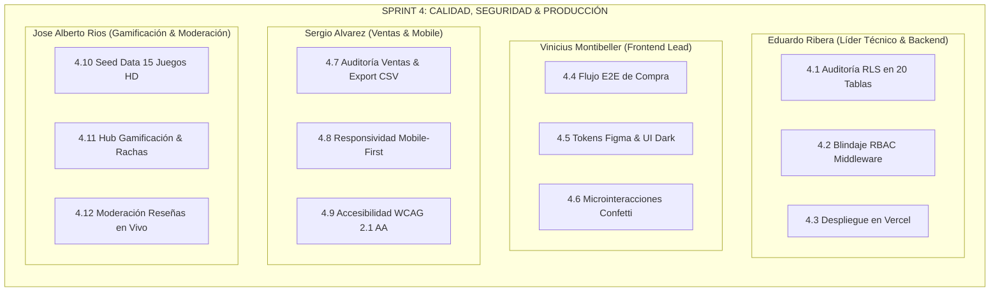

# 🚀 ViniGames — Plan Detallado de Tareas: Sprint 4

> **Proyecto**: ViniGames — Plataforma E-Commerce Gamer, Gamificación & Asistencia IA  
> **Fase**: **Sprint 4 — Calidad, Auditoría RLS, Seed Data, Responsividad y Despliegue en Producción**  
> **Universidad**: Universidad Tecnológica Privada de Santa Cruz (UTEPSA) | Gestión 2026  
> **Docente Guía**: Ing. Bryana Ojopi Banegas  
> **Nota de Equipo**: *Reorganización estratégica para 4 desarrolladores activos (Shaimme Zelada inactiva).*

---

## 📊 1. Tabla General de Asignación de Tareas (Sprint 4)

| ID | Actividad / Tarea | Responsable | Módulo / Ruta | Criterio de Aceptación / Entregable | Estado |
| :---: | :--- | :---: | :---: | :--- | :---: |
| **4.1** | **Auditoría Exhaustiva de Políticas RLS** en las 20 tablas de PostgreSQL. | **Eduardo Ribera** | Supabase DB / RLS | Ningún usuario anónimo puede leer ni alterar datos privados; solo `ADMIN` escribe en tablas maestras. | 🟡 En Progreso |
| **4.2** | **Blindaje de Middleware Edge & Control RBAC** en rutas protegidas. | **Eduardo Ribera** | `middleware.ts` / `/admin/*` | Redirección automática de usuarios no autorizados sin credenciales `ADMIN`. | ⚪ Pendiente |
| **4.3** | **Despliegue Continuo en Vercel (Producción)** y conexión de variables de entorno. | **Eduardo Ribera** | Vercel Cloud | Build exitoso de las 26 rutas con conexión a Supabase y Webhook Railway. | ⚪ Pendiente |
| **4.4** | **Prueba de Recorrido End-to-End del Flujo de Compra** (Home ➔ Catálogo ➔ Carrito ➔ Checkout ➔ Biblioteca). | **Vinicius Montibeller** | `/`, `/catalog`, `/cart`, `/library` | Compra simulada exitosa con código `TX-XXXX` y transferencia instantánea del juego a la biblioteca. | ⚪ Pendiente |
| **4.5** | **Auditoría de Consistencia Visual y Tokens Figma** (Dark Gamer `#090B14`, `#783DF2`, `#1FD1EB`). | **Vinicius Montibeller** | `globals.css` / UI Components | Cero desalineaciones estéticas y cumplimiento al 100% de la paleta oficial. | ⚪ Pendiente |
| **4.6** | **Validación de Microinteracciones y Efectos** (Confetti, modales y hover de tarjetas). | **Vinicius Montibeller** | `components/ui/*` | Animaciones fluidas a 60 FPS sin parpadeos ni bloqueos del hilo principal. | ⚪ Pendiente |
| **4.7** | **Auditoría del Módulo de Ventas y Exportación CSV** con desglose de órdenes. | **Sergio Alvarez** | `/admin/sales` | Reporte descargable en `.csv` con todas las columnas transaccionales correctas. | ⚪ Pendiente |
| **4.8** | **Pruebas de Responsividad Mobile-First** (Pantallas de 360px a 430px y tablets). | **Sergio Alvarez** | Todas las vistas | Cero scroll horizontal no deseado y botones accesibles al tacto en smartphones. | ⚪ Pendiente |
| **4.9** | **Cumplimiento de Estándares de Accesibilidad WCAG 2.1 AA** (Aria-labels y contraste). | **Sergio Alvarez** | `components/*` | Botones de iconos con `aria-label` descriptivos y contraste de texto $\ge 4.5:1$. | ⚪ Pendiente |
| **4.10** | **Carga y Verificación del Dataset Demo (*Seed Data*)** con 12 a 15 videojuegos completos. | **Jose Alberto Rios** | `/catalog`, `/games/[slug]` | Fichas completas con portadas HD, precios en Bs., capturas y categorías reales. | ⚪ Pendiente |
| **4.11** | **Validación Integral del Hub de Gamificación** (Niveles, XP, Rachas de 7 días y Medallas). | **Jose Alberto Rios** | `/gamification`, `/profile` | Progresión matemática de nivel correcta y reclamo de recompensas con GameCoins. | ⚪ Pendiente |
| **4.12** | **Auditoría de la Cola de Moderación de Reseñas** y sincronización con la tienda. | **Jose Alberto Rios** | `/admin/reviews` | Aprobación/Rechazo en vivo con ocultamiento inmediato de reseñas rechazadas en tienda. | ⚪ Pendiente |

---

## 👥 2. Desglose Detallado de Responsabilidades por Integrante

---

### 👤 1. Eduardo Ribera — Líder Técnico, Seguridad Backend & Despliegue
* **Tarea 4.1**: Revisar los scripts DDL y políticas de seguridad en Supabase PostgreSQL. Asegurar que las tablas sensibles (`profiles`, `orders`, `order_items`, `admin_audit_logs`, `reviews`, `review_votes`, `chat_sessions`, `chat_messages`) cuenten con directivas `ALTER TABLE ... ENABLE ROW LEVEL SECURITY;` y políticas estrictas `auth.uid() = user_id`.
* **Tarea 4.2**: Reforzar [`middleware.ts`](file:///c:/Users/Eduardo/Desktop/ViniGames/vinigames/middleware.ts) para validar el rol `ADMIN` en la ruta perimetral `/admin/*` y refrescar tokens JWT de forma segura.
* **Tarea 4.3**: Configurar el proyecto en **Vercel**, vincular el repositorio oficial de GitHub (`main`), configurar las variables de entorno de producción y certificar el build con 0 advertencias.

---

### 👤 2. Vinicius Montibeller — Frontend Lead, E-Commerce & Consistencia Visual
* **Tarea 4.4**: Ejecutar pruebas integrales del embudo de compras: agregar títulos al carrito, verificar la persistencia en `cart_items` y `localStorage`, ejecutar el checkout simulado con tarjeta de prueba y confirmar la emisión del comprobante `TX-XXXX`.
* **Tarea 4.5**: Auditar todos los componentes visuales con los tokens de diseño de Figma: fondo oscuro `#090B14`, contenedores `#131521`, violeta `#783DF2`, cian eléctrico `#1FD1EB` y verde esmeralda `#10B981`.
* **Tarea 4.6**: Validar la fluidez de las animaciones de celebración (Canvas Confetti), transiciones de modales y efectos hover en las tarjetas de juego.

---

### 👤 3. Sergio Alvarez — Auditoría Comercial, Responsividad Mobile & Accesibilidad
* **Tarea 4.7**: Auditar la vista `/admin/sales`, verificando que las órdenes generadas se reflejen en la tabla transaccional y que la utilidad de exportación (`lib/utils/csv-exporter.ts`) genere archivos `.csv` compatibles con Excel.
* **Tarea 4.8**: Probar la aplicación en emuladores de dispositivos móviles (iPhone 14/15, Samsung Galaxy, iPad) asegurando que no existan desbordamientos ni scroll horizontal accidental.
* **Tarea 4.9**: Implementar mejoras de accesibilidad (etiquetas `aria-label` en botones interactivos, roles accesibles y ratios de contraste de color).

---

### 👤 4. Jose Alberto Rios — Seed Data, Gamificación & Moderación Social
* **Tarea 4.10**: Validar el catálogo demo con al menos 12 a 15 videojuegos que incluyan títulos destacados (*Neon Odyssey*, *Shadows of Eldoria*, *Chrono Nexus*, *Cyber Horizon*, etc.) con datos completos en bolivianos (Bs.).
* **Tarea 4.11**: Verificar la lógica del Hub de Gamificación (`/gamification`): incremento de XP al calificar juegos (+50 XP) y comprar (+100 XP), contador de racha diaria de 7 días y saldo de GameCoins.
* **Tarea 4.12**: Probar la cola de moderación en `/admin/reviews`: aprobar y rechazar reseñas, verificando la persistencia y la sincronización con el feed público de la tienda.

---

## 🧪 3. Checklist de Criterios de Aceptación para la Entrega Final

- [ ] **Base de Datos Segura:** Políticas RLS activas en las 20 tablas de Supabase.
- [ ] **Asistente IA Operativo:** ViniChat respondiendo 24/7 desde Railway Cloud con DeepSeek.
- [ ] **Flujo Comercial Completo:** Carrito, Checkout, Comprobante `TX-XXXX` y Biblioteca funcionando.
- [ ] **Gamificación y Rachas:** Niveles, XP, GameCoins y medallas calculándose en tiempo real.
- [ ] **Panel ViniAdmin:** CRUD de juegos con baja lógica, moderación de reseñas y exportación CSV.
- [ ] **Compilación Limpia:** `npm run build` exitoso con 26 rutas optimizadas.
- [ ] **Despliegue Productivo:** Aplicación publicada en Vercel con HTTPS activo.
