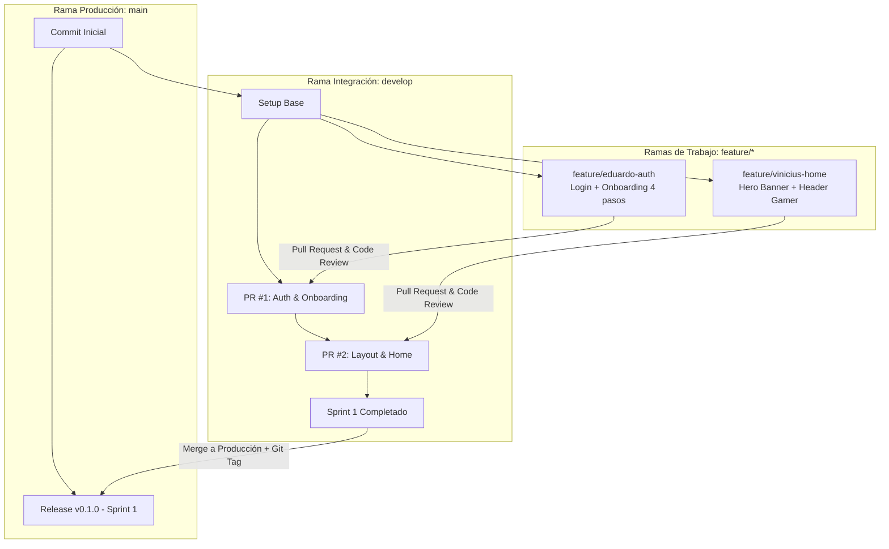

# 🐙 ViniGames — Guía de Git y GitHub para el Trabajo Colaborativo en Equipo

> **Propósito**: Estandarizar el flujo de trabajo en Git para los 5 integrantes de ViniGames (UTEPSA 2026), garantizando que cada actualización se suba de forma ordenada, sin conflictos y con trazabilidad académica completa.

---

## 🌳 1. Estrategia de Ramas (Branching Model - GitHub Flow)

Para evitar sobrescribir el trabajo de los compañeros y mantener un historial limpio, utilizaremos un modelo de tres niveles:



### Roles de las Ramas:
1. **`main` (Producción)**: Solo contiene código $100\%$ estable, probado y listo para evaluación docente. Está conectada al despliegue automático en **Vercel**.
2. **`develop` (Integración)**: Es la rama principal de trabajo diario del equipo. Aquí se integran todas las funcionalidades completadas.
3. **`feature/<nombre-integrante>-<funcionalidad>`**: Ramas individuales temporales donde cada integrante desarrolla su tarea asignada en el plan de implementación.

---

## 🏷️ 2. Convención de Nombres de Ramas (Alineada al Plan de Sprints)

Cada integrante debe nombrar sus ramas siguiendo esta estructura:

| Integrante | Rama Sugerida para Sprint 1 | Rama Sugerida para Sprint 2 | Rama Sugerida para Sprint 3 |
| :--- | :--- | :--- | :--- |
| **Eduardo** | `feature/eduardo-auth-onboarding` | `feature/eduardo-reviews-voting` | `feature/eduardo-vinichat-n8n-deepseek` |
| **Vinicius** | `feature/vinicius-layout-home` | `feature/vinicius-cart-checkout` | `feature/vinicius-admin-crud-games` |
| **Sergio** | `feature/sergio-game-details` | `feature/sergio-wishlist-storage` | `feature/sergio-admin-sales-csv` |
| **Shaimme** | `feature/shaimme-catalog-filters` | `feature/shaimme-user-library` | `feature/shaimme-admin-dashboard-kpis` |
| **Jose Alberto** | `feature/jose-profile-gamer-dna` | `feature/jose-gamification-hub` | `feature/jose-admin-review-moderation` |

---

## 🔄 3. Flujo de Trabajo Diario Paso a Paso (Paso a Paso)

### Paso 1: Iniciar el día actualizando tu copia local
Antes de empezar a programar cualquier cambio, asegúrate de tener lo último que subieron tus compañeros a `develop`:

```bash
# Cambiar a la rama de integración
git checkout develop

# Descargar y sincronizar los últimos cambios
git pull origin develop
```

---

### Paso 2: Crear tu rama de trabajo individual
Crea una nueva rama a partir de `develop` con el nombre de la tarea que vas a desarrollar:

```bash
# Crear y cambiarse a tu nueva rama feature
git checkout -b feature/tu-nombre-tarea

# Ejemplo:
# git checkout -b feature/vinicius-cart-checkout
```

---

### Paso 3: Programar y probar localmente
Edita tu código en Next.js. Asegúrate de verificar que el proyecto compila localmente sin errores:

```bash
# En la carpeta vinigames/
npm run dev

# Para verificar que no existan errores de TypeScript o ESLint
npm run lint
```

---

### Paso 4: Preparar los cambios para guardar (Staging)
Revisa qué archivos has modificado y agrégalos al área de preparación:

```bash
# Ver el estado de los archivos modificados
git status

# Agregar todos los archivos modificados
git add .
```

---

### Paso 5: Crear el Commit con Formato Estándar (*Conventional Commits*)
Escribe mensajes de confirmación claros y descriptivos según el tipo de cambio:

| Prefijo | Cuándo Usarlo | Ejemplo |
| :--- | :--- | :--- |
| `feat:` | Una nueva funcionalidad o pantalla | `git commit -m "feat: agregar selector de avatar en onboarding paso 1"` |
| `fix:` | Corrección de un error o bug | `git commit -m "fix: corregir calculo de descuento en checkout"` |
| `style:` | Cambios visuales de Tailwind CSS sin alterar lógica | `git commit -m "style: ajustar bordes neon en las tarjetas de juego"` |
| `docs:` | Actualización de documentación o informe | `git commit -m "docs: actualizar diagrama DER en la base de conocimiento"` |
| `refactor:`| Reestructuración de código sin cambiar funcionalidad | `git commit -m "refactor: modularizar funcion de calculo de XP"` |

Ejecutar el comando:
```bash
git commit -m "feat: implementar drawer interactivo de carrito de compras"
```

---

### Paso 6: Subir tu rama a GitHub
Sube tu rama al repositorio remoto para que esté respaldada en la nube:

```bash
git push -u origin feature/tu-nombre-tarea

# Ejemplo:
# git push -u origin feature/vinicius-cart-checkout
```

---

### Paso 7: Crear el Pull Request (PR) en GitHub
1. Abre tu repositorio en **GitHub.com**.
2. Verás un botón verde que dice **"Compare & pull request"**. Haz clic en él.
3. **Configuración crucial**:
   - **Base**: `develop` *(¡Nunca hagas PR directo a `main`!)*.
   - **Compare**: `feature/tu-nombre-tarea`.
4. Escribe un título y descripción clara del trabajo realizado:
   ```markdown
   ## 📌 Descripción de Cambios
   - Se construyó el componente `CartDrawer.tsx` con soporte para eliminar ítems.
   - Se añadió la Server Action `processSimulatedCheckout` con código TX-XXXX.
   - Se validaron los totales y cálculo de descuentos.

   ## 🧪 Pruebas Realizadas
   - [x] Probado en localhost:3000 con sesión iniciada.
   - [x] Verificado el vaciado del carrito tras completar la compra.
   ```
5. Haz clic en **"Create pull request"**.

---

### Paso 8: Revisión de Código y Merge (Aprobación)
1. Al menos **uno de los compañeros de equipo** debe revisar el PR en GitHub, verificar que no rompa nada y hacer clic en **"Approve"**.
2. Luego, se presiona el botón **"Merge pull request"** y se selecciona **"Confirm merge"**.
3. Finalmente, se borra la rama feature en GitHub haciendo clic en **"Delete branch"** para mantener limpio el repositorio.

---

## 💥 4. Cómo Resolver Conflictos de Código (Merge Conflicts)

Si dos integrantes editaron el mismo archivo al mismo tiempo, Git indicará un conflicto al intentar unir la rama. Para solucionarlo sin estrés:

```bash
# 1. Asegúrate de estar en tu rama de trabajo
git checkout feature/tu-nombre-tarea

# 2. Trae los cambios de develop a tu rama
git pull origin develop

# 3. Git marcará los archivos en conflicto.
# Ábrelos en tu editor de código (VS Code) y verás:
# <<<<<<< HEAD (Tus cambios)
# =======
# >>>>>>> develop (Los cambios de tu compañero)

# 4. Elige la versión correcta o combina ambas líneas.
# 5. Guarda el archivo y marca el conflicto como resuelto:
git add .
git commit -m "fix: resolver conflicto de mezcla con develop"
git push origin feature/tu-nombre-tarea
```

---

## 🏆 5. Etiquetas de Versión para Entregas Universitarias (Releases & Tags)

Al finalizar cada Sprint antes de presentarlo al docente, el líder del equipo fusionará `develop` en `main` y creará una etiqueta (*Git Tag*):

```bash
# 1. Cambiarse a main y actualizar
git checkout main
git pull origin main

# 2. Mezclar lo terminado en develop
git merge develop

# 3. Crear la etiqueta de entrega
git tag -a v0.1.0 -m "Entrega Sprint 1: Autenticacion, Onboarding, Layout y Catalogo"

# 4. Subir los tags a GitHub
git push origin main --tags
```

### Tabla de Tags del Proyecto ViniGames:
- `v0.1.0-sprint1`: Entrega Sprint 1 (Auth, Onboarding 4 pasos, Catálogo y Ficha de Juego).
- `v0.2.0-sprint2`: Entrega Sprint 2 (Carrito, Checkout Simulado, Biblioteca y Rachas).
- `v0.3.0-sprint3`: Entrega Sprint 3 (ViniChat con n8n y DeepSeek + Panel ViniAdmin).
- `v1.0.0-final`: Entrega Final de la Materia (Sistema completo desplegado en Vercel).
