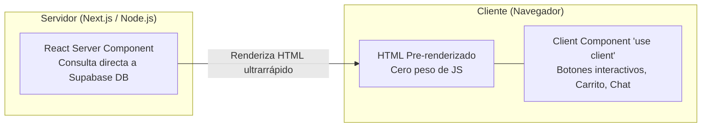
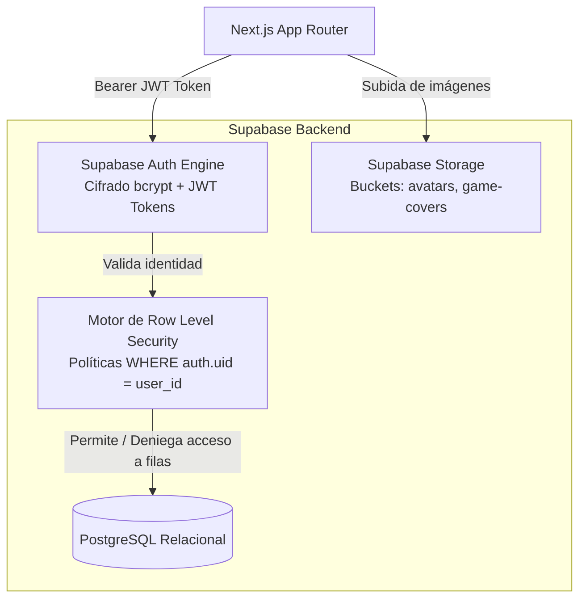
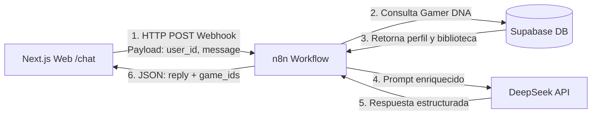
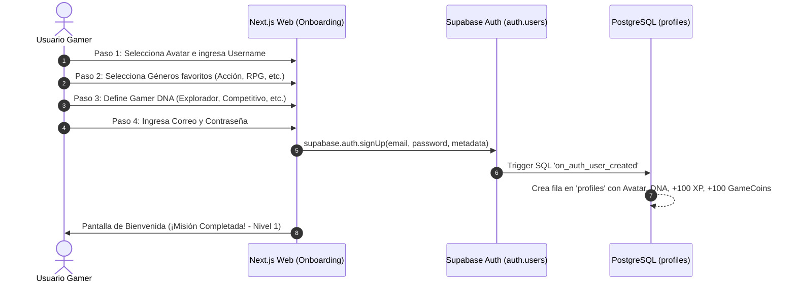
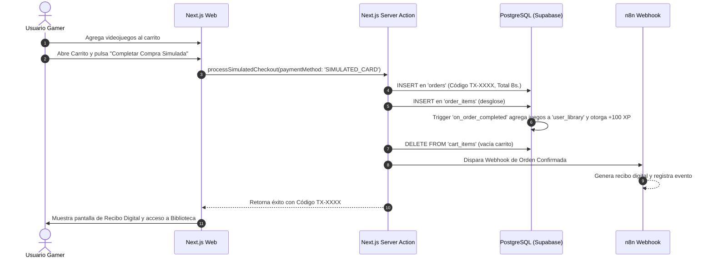

# 📚 ViniGames — Guía Didáctica de Tecnologías, Arquitectura y Flujos

> **Propósito**: Manual de estudio integral para el equipo de desarrollo de ViniGames (UTEPSA 2026).  
> **Objetivo**: Explicar a profundidad los fundamentos de cada tecnología utilizada, los patrones de diseño y el funcionamiento paso a paso de cada flujo de negocio del sistema.

---

## 📑 Tabla de Contenidos
1. [Next.js 16 & React 19: Fundamentos y Patrones Modernos](#1-nextjs-16--react-19-fundamentos-y-patrones-modernos)
2. [Tailwind CSS v4: Sistema de Diseño y Tokens](#2-tailwind-css-v4-sistema-de-diseño-y-tokens)
3. [Supabase: Autenticación, PostgreSQL y Row Level Security (RLS)](#3-supabase-autenticación-postgresql-y-row-level-security-rls)
4. [n8n Automation: Motor de Orquestación y Middleware Asíncrono](#4-n8n-automation-motor-de-orquestación-y-middleware-asíncrono)
5. [DeepSeek API: Inteligencia Artificial Generativa y Gamer DNA](#5-deepseek-api-inteligencia-artificial-generativa-y-gamer-dna)
6. [Flujos de Negocio Explicados Paso a Paso (Diagramas y Lógica)](#6-flujos-de-negocio-explicados-paso-a-paso)

---

## ⚛️ 1. Next.js 16 & React 19: Fundamentos y Patrones Modernos

### 1.1. React Server Components (RSC) vs Client Components
En Next.js 16 (App Router), los componentes son **Server Components por defecto**. Esto significa que se ejecutan exclusivamente en el servidor de Vercel y envían HTML estático pre-renderizado al navegador, sin añadir código JavaScript al bundle del cliente.



- **¿Cuándo usar Server Components?**
  - Para leer datos de la base de datos (Catálogo de juegos, detalles de un juego en `/games/[slug]`, página de inicio `/`).
  - Para proteger credenciales sensibles (tokens de API, claves privadas).
  - Para mejorar el SEO y reducir el First Contentful Paint (FCP).

- **¿Cuándo usar Client Components (`'use client'`)?**
  - Cuando el componente requiere interactividad del usuario (formularios con inputs, modales emergentes, acordeones).
  - Cuando se usan React Hooks (`useState`, `useEffect`, `useActionState`, `useOptimistic`).
  - Para escuchar eventos del navegador (`onClick`, `onChange`, `onKeyDown`).

---

### 1.2. Server Actions (`'use server'`)
Las **Server Actions** son funciones asíncronas de JavaScript que se declaran en el servidor y pueden ser invocadas directamente desde formularios o botones en el cliente, **sin necesidad de escribir manualmente rutas de API REST (`fetch('/api/...')`)**.

```typescript
// app/actions/cart.actions.ts
"use server"; // Le indica a Next.js que esta función corre SOLO en el servidor

import { createServerSupabaseClient } from "@/lib/supabase/server";
import { revalidatePath } from "next/cache";

export async function addToCartAction(gameId: number) {
  const supabase = await createServerSupabaseClient();
  const { data: { user } } = await supabase.auth.getUser();
  
  if (!user) throw new Error("Debes iniciar sesión");

  await supabase.from("cart_items").insert({
    user_id: user.id,
    game_id: gameId,
  });

  // Revalida la caché del servidor para que el carrito se actualice en la pantalla
  revalidatePath("/cart");
}
```

---

## 🎨 2. Tailwind CSS v4: Sistema de Diseño y Tokens

Tailwind CSS v4 elimina la necesidad de archivos de configuración pesados (`tailwind.config.js`) y centraliza el diseño mediante **CSS Variables Nativas**.

### 2.1. Paleta de Colores de ViniGames (Dark Gamer Cyberpunk)
- **Fondo Base (`bg-zinc-950`)**: `#090B14` (Oscuridad profunda, reduce fatiga visual gamer).
- **Superficie de Tarjetas (`bg-zinc-900`)**: `#1A1C2B` (Contraste para carátulas y paneles).
- **Bordes Activos (`border-zinc-800`)**: `#2E334A` (Líneas sutiles de separación).
- **Acento Violeta Neón (`bg-purple-600` / `#783DF2`)**: Botones primarios, barras de XP y destacados.
- **Acento Cian (`text-cyan-400` / `#1FD1EB`)**: Saldo de GameCoins y medallas de exploración.
- **Acento Esmeralda (`text-emerald-400` / `#10B981`)**: Racha activa, descuentos aplicados y estado "Completado".

---

## 🛡️ 3. Supabase: Autenticación, PostgreSQL y Row Level Security (RLS)

Supabase no es solo una base de datos, es una suite completa de Backend como Servicio (BaaS) montada sobre **PostgreSQL 15+**.



### 3.1. Supabase Auth y la Separación con `profiles`
Supabase maneja los correos y contraseñas cifradas en una tabla privada e inaccesible llamada `auth.users`.
Para guardar datos específicos de ViniGames (avatar, nivel, Gamer DNA, GameCoins), creamos la tabla pública `profiles`, vinculada mediante una clave foránea `id UUID REFERENCES auth.users(id) ON DELETE CASCADE`.

### 3.2. ¿Qué es Row Level Security (RLS) y por qué es crucial?
En bases de datos tradicionales, si un usuario malicioso descubría cómo consultar la tabla `cart_items`, podía ver los carritos de todos los usuarios.
Con **RLS**, PostgreSQL evalúa una condición en cada fila antes de entregarla:
```sql
-- Solo entrega filas donde el user_id coincida con el usuario autenticado en el token JWT
CREATE POLICY "Usuarios solo ven su propio carrito" 
ON public.cart_items 
FOR SELECT 
USING (auth.uid() = user_id);
```
Esto garantiza **seguridad a nivel de motor de base de datos**.

---

## ⚡ 4. n8n Automation: Motor de Orquestación y Middleware Asíncrono

**n8n** es un motor de flujos de trabajo programables basado en nodos visuales y eventos HTTP.

### 4.1. ¿Por qué usamos n8n como intermediario?
1. **Desacoplamiento**: Si la API de IA cambia de proveedor o parámetros, solo se edita el nodo en n8n sin tener que volver a compilar o desplegar la aplicación web en Vercel.
2. **Tareas Pesadas en Segundo Plano**: Tareas como generar un PDF de comprobante, enviar un correo transaccional o calcular rachas nocturnas no saturan el servidor web de Next.js.
3. **Monitoreo Visual**: n8n guarda un registro de cada ejecución con los datos exactos que entraron y salieron.



---

## 🧠 5. DeepSeek API: Inteligencia Artificial Generativa y Gamer DNA

El motor de IA en ViniGames utiliza el modelo `deepseek-chat` a través de n8n.

### 5.1. El Concepto de Gamer DNA
Durante el Onboarding, el usuario responde preferencias que ponderan 4 arquetipos de jugador:
1. **Explorador ($\%$ Exploración)**: Prefiere mundos abiertos, secretos, lore y descubrimientos.
2. **Competitivo ($\%$ Competitivo)**: Prefiere rankings, PvP, mecánicas de alta habilidad y dificultad.
3. **Narrativo ($\%$ Narrativo)**: Prefiere historias profundas, decisiones morales y cinemáticas.
4. **Coleccionista ($\%$ Coleccionismo)**: Prefiere completar el 100% de logros, desbloquear skins y acumular ítems.

### 5.2. Inyección de Contexto en el Prompt de IA
Cuando el usuario escribe *"Recomiéndame algo para jugar este fin de semana"*, n8n inyecta:
- Sus porcentajes de Gamer DNA (ej: $60\%$ Explorador, $24\%$ Narrativo, $16\%$ Coleccionista).
- Los juegos que ya posee en su biblioteca (para no repetirlos).
- Los títulos disponibles en el catálogo.

---

## 🔄 6. Flujos de Negocio Explicados Paso a Paso

### 6.1. Flujo 1: Registro & Onboarding Gamificado en 4 Pasos



---

### 6.2. Flujo 2: Catálogo, Carrito y Simulación de Compra



---

### 6.3. Flujo 3: Biblioteca Personal, Contador de Horas y Reseñas Verificadas

1. **Consulta de Biblioteca**: El jugador ingresa a `/library`. El componente Server Component consulta `user_library` con un `JOIN` a `games`.
2. **Interacción "Jugar"**: Al hacer clic en `▶ Jugar`, el cliente ejecuta una Server Action que simula el lanzamiento, actualiza el estado a `INSTALLED` e incrementa las `hours_played`.
3. **Redacción de Reseña**:
   - El sistema verifica en `user_library` si el usuario posee el juego (`is_verified_purchase = true`).
   - Si no lo posee, el botón de reseña está bloqueado.
   - Si lo posee, envía el formulario validado con Zod a `createReviewAction`.
   - Se guarda en `reviews` con estado `APPROVED` y se acreditan automáticamente $+50 \text{ XP}$ y $+25 \text{ GameCoins}$.
4. **Votación Comunitaria**: Otros jugadores pueden hacer clic en `👍 Útil` o `👎 No Útil`. La tabla `review_votes` registra el voto evitando duplicados con `UNIQUE (review_id, user_id)`.

---

### 6.4. Flujo 4: Motor de Gamificación (Rachas Diarias y XP)

1. **Detección de Conexión**: Al iniciar sesión o cargar la página principal:
   - Se compara `last_login_date` contra `CURRENT_DATE`.
   - Si `last_login_date = CURRENT_DATE`: No hace nada (ya sumó su racha de hoy).
   - Si `last_login_date = CURRENT_DATE - 1`: Suma $+1$ a `current_streak`, acredita $+20 \text{ XP}$ y registra en `streak_logs`. Si la racha llega a 7 días, otorga un bono especial de $+50 \text{ XP}$ y la medalla `SEVEN_DAY_STREAK`.
   - Si `last_login_date < CURRENT_DATE - 1`: La racha se reinicia a 1.
2. **Cálculo Matemático de Nivel**:
   $$\text{Nivel } N \iff \text{XP Total} \ge 100 \times N^{1.5}$$
   El frontend actualiza en vivo la barra de progreso hacia el siguiente nivel.

---

### 6.5. Flujo 5: Asistente Virtual ViniChat (Conversación con IA)

1. El usuario abre `/chat` y escribe un mensaje (ej: *"¿Qué juego me recomiendas si me gustó Neon Odyssey?"*).
2. El cliente de Next.js guarda el mensaje del usuario en `chat_messages` y realiza una petición POST al endpoint de webhook de **n8n**.
3. **n8n** consulta el perfil del usuario en Supabase (Gamer DNA y juegos ya comprados).
4. **n8n** formula el prompt para **DeepSeek API (`deepseek-chat`)**, solicitando una respuesta amigable en Markdown y un array de IDs de juegos recomendados.
5. **DeepSeek** responde el JSON.
6. **n8n** retorna la respuesta a Next.js.
7. Next.js guarda la respuesta del asistente en `chat_messages` y renderiza el texto junto con las **Product Cards Interactivas** con botón de compra directa.
