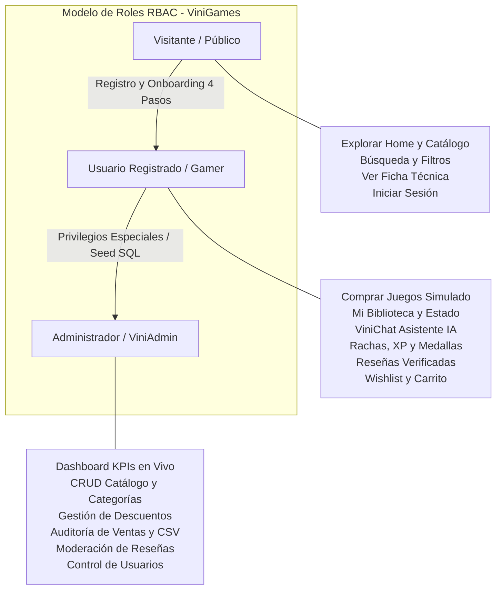
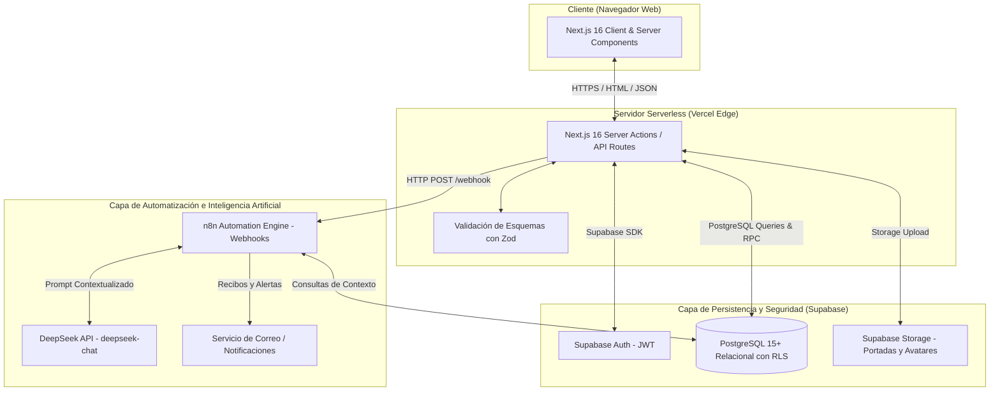

# 🎮 ViniGames — Informe Integral y Estructurado del Proyecto

> **Universidad Tecnológica Privada de Santa Cruz (UTEPSA)**  
> **Facultad de Tecnología** — *Carrera: Ingeniería en Sistemas*  
> **Materia**: Desarrollo de Aplicaciones Web  
> **Docente**: Ing. Bryana Ojopi Banegas  
> **Semestre / Gestión**: 2026  
> **Equipo de Desarrollo**:  
> 1. **Vinicius Montibeller**  
> 2. **Sergio Alvarez**  
> 3. **Shaimme Zelada**  
> 4. **Eduardo Ribera**  
> 5. **Jose Alberto Rios**  

---

## 📌 1. Introducción y Descripción del Proyecto

**ViniGames** es una plataforma web moderna de comercio electrónico digital, descubrimiento asistido por Inteligencia Artificial y gestión comunitaria de videojuegos para PC y consolas.

### 1.1. Contexto y Justificación
En el mercado actual, la experiencia de los jugadores de videojuegos se encuentra fragmentada:
- **Dispersión de información**: Los usuarios deben consultar catálogos en una tienda, críticas en foros externos y guías en redes sociales.
- **Falta de incentivos de retención**: Las plataformas tradicionales no recompensan la fidelidad ni la participación constructiva en la comunidad.
- **Recomendaciones genéricas**: La mayoría de las tiendas recomiendan títulos según popularidad global en lugar de analizar la personalidad psicográfica de juego del usuario.

**ViniGames** unifica estos elementos en un ecosistema integrado:
1. Catálogo comercial interactivo con simulación de compra transaccional y checkout en tiempo real.
2. Biblioteca digital personal con seguimiento de estado de instalación y horas jugadas.
3. Asistente Virtual Inteligente (**ViniChat**) impulsado por **DeepSeek API** y orquestado mediante **n8n**, capaz de interpretar el perfil de juego (*Gamer DNA*) y la biblioteca del usuario para ofrecer sugerencias hiperpersonalizadas.
4. Motor de Gamificación que incentiva la retención diaria (rachas continuas), la progresión de niveles mediante Puntos de Experiencia (XP), economía virtual en *GameCoins* y medallas de logros desbloqueables.
5. Sistema de Reseñas Verificadas con votación comunitaria de utilidad (*Helpful / Not Helpful*).
6. Panel Administrativo integral (**ViniAdmin**) para gestión de catálogo, auditoría transaccional, moderación de contenido y métricas de negocio.

---

## 🎯 2. Objetivos del Proyecto

### 2.1. Objetivo General
Desarrollar una plataforma web integral para la venta digital y gestión de videojuegos basada en Next.js, Supabase y PostgreSQL, que incorpore asistencia personalizada por Inteligencia Artificial y dinámicas de gamificación comunitaria para optimizar el descubrimiento, adquisición y valoración de videojuegos.

### 2.2. Objetivos Específicos
1. **Módulo de Identidad y Seguridad**: Implementar un sistema de autenticación robusto basado en Supabase Auth y Row Level Security (RLS), integrando un proceso de Onboarding gamificado en 4 etapas para construir el perfil *Gamer DNA*.
2. **Módulo Transaccional y Catálogo**: Construir una tienda reactiva con catálogo filtrable por géneros múltiples, buscador predictivo, carrito de compras, cálculo dinámico de promociones y simulación de compra con emisión de recibo digital.
3. **Módulo de Biblioteca y Reseñas Verificadas**: Desarrollar la biblioteca privada del usuario con control de estados y un sistema de calificaciones de 1 a 5 estrellas exclusivo para compradores comprobados.
4. **Módulo de Gamificación**: Diseñar un motor de retención basado en cálculo diario de rachas de conexión, progresión matemática de niveles por XP, acumulación de GameCoins para recompensas cosméticas y catálogo de medallas.
5. **Módulo de Inteligencia Artificial (ViniChat & n8n)**: Integrar un flujo de orquestación desacoplado con n8n y DeepSeek API para brindar soporte conversacional, recomendaciones estructuradas y moderación de contenido.
6. **Módulo Administrativo (ViniAdmin)**: Proveer una interfaz de administración segura para la gestión CRUD del catálogo, auditoría de compras con exportación de datos y supervisión comunitaria.

---

## 🧭 3. Alcance del Sistema (Límites del Proyecto)

| Módulos y Funcionalidades INCLUIDAS | Aspectos y Funcionalidades NO INCLUIDAS |
| :--- | :--- |
| • Autenticación segura y Onboarding en 4 pasos con Supabase Auth. • Roles del sistema: Visitante, Usuario Registrado (Gamer) y Administrador. • Catálogo dinámico con búsqueda, filtros múltiples y ficha técnica detallada. • Lista de Deseos (Wishlist) y Carrito de compras reactivo. • Simulación transaccional de compra y generación de recibo digital. • Biblioteca personal con estados (*Instalado / No Instalado*) y horas jugadas. • Sistema de reseñas comunitarias exclusivas para compradores verificados. • Sistema de votación de utilidad (*Helpful / Unhelpful*) en reseñas. • Motor de gamificación: Rachas diarias de 7 días, niveles, XP y medallas. • Asistente virtual ViniChat (DeepSeek + n8n webhook) con cards de compra. • Panel Administrativo (ViniAdmin) con métricas KPIs, CRUD y exportación CSV. • Despliegue continuo en Vercel conectado a PostgreSQL en Supabase. | • Integración con pasarelas de pago bancarias reales (Stripe con cobro a tarjetas reales). • Servidores de almacenamiento y distribución masiva de binarios de instalación (CDN de 50GB+). • Soporte nativo para APIs propietarias de consolas físicas (PSN, Xbox Live, Nintendo). • Servicios de renderizado y streaming de videojuegos en la nube (*Cloud Gaming*). |

---

## 👥 4. Usuarios y Roles del Sistema (RBAC)

---

## 📋 5. Matriz de Requerimientos Funcionales y No Funcionales

### 5.1. Requerimientos Funcionales (RF-01 a RF-20)
| Código | Módulo | Descripción Funcional |
| :---: | :--- | :--- |
| **RF-01** | Autenticación | Registro de nuevas cuentas, login seguro, logout y recuperación de credenciales mediante Supabase Auth. |
| **RF-02** | Perfil Gamer | Edición de avatar, nombre de usuario gamer, biografía y visualización del Gamer DNA y saldo GameCoins. |
| **RF-03** | Asistente IA | Interacción en lenguaje natural con ViniChat (DeepSeek + n8n) para consultas y recomendaciones de catálogo. |
| **RF-04** | Catálogo | Visualización interactiva de juegos con portadas, precios, descuentos y trailers multimedia. |
| **RF-05** | Búsqueda/Filtros | Búsqueda por texto en tiempo real y filtrado combinado por categorías múltiples, precio y ofertas. |
| **RF-06** | Wishlist | Adición, consulta y eliminación de títulos en la lista de favoritos con alerta visual de descuento. |
| **RF-07** | Carrito | Gestión reactiva de títulos a adquirir con cálculo automático de totales. |
| **RF-08** | Descuentos | Aplicación matemática de rebajas porcentuales vigentes sobre el precio regular en Bolivianos (Bs.). |
| **RF-09** | Simulación Compra | Procesamiento de checkout simulado con tarjeta virtual y emisión de recibo digital transaccional. |
| **RF-10** | Biblioteca | Acceso privado a títulos adquiridos con estado de instalación (`NOT_INSTALLED`, `INSTALLED`) y horas jugadas. |
| **RF-11** | Publicar Reseña | Calificación de 1 a 5 estrellas y redacción de opiniones restringidas a compradores comprobados (+50 XP). |
| **RF-12** | Editar Reseña | Modificación o eliminación de la reseña propia por parte del usuario autor. |
| **RF-13** | Votación Utilidad | Votación comunitaria (*Útil / No Útil*) en reseñas de otros jugadores con prevención de voto duplicado. |
| **RF-14** | Rachas y XP | Detección diaria de actividad para sumar rachas consecutivas (1 a 7 días) y progresión de niveles por XP. |
| **RF-15** | CRUD Catálogo | Creación, actualización, activación y baja lógica de videojuegos y categorías desde el panel admin. |
| **RF-16** | Promociones | Programación temporal de porcentajes de descuento con fecha de inicio y vencimiento. |
| **RF-17** | Gestión Usuarios | Listado de cuentas registradas, supervisión de actividad y asignación de roles administrativos. |
| **RF-18** | Moderación | Cola de supervisión de reseñas con capacidad de aprobar, rechazar o eliminar comentarios ofensivos. |
| **RF-19** | Auditoría Ventas | Registro cronológico inmutable de todas las compras con filtros por estado y usuario. |
| **RF-20** | Reportes Admin | Generación de métricas consolidadas (KPIs de ventas, retención de rachas) y exportación a archivo CSV. |

### 5.2. Requerimientos No Funcionales (RNF-01 a RNF-12)
- **RNF-01 (Diseño)**: Interfaz oscura inmersiva (*Dark Gamer Theme*) maquetada con Tailwind CSS v4.
- **RNF-02 (Responsividad)**: Adaptabilidad fluida a resoluciones móviles, tablets y desktop (*Mobile-First*).
- **RNF-03 (Compatibilidad)**: Soporte completo en Google Chrome, Microsoft Edge, Mozilla Firefox y Safari.
- **RNF-04 (Seguridad)**: Cifrado robusto con Supabase Auth y políticas declarativas de *Row Level Security (RLS)* en PostgreSQL.
- **RNF-05 (Validación)**: Validación estricta de esquemas en cliente y servidor con **Zod** y TypeScript.
- **RNF-06 (Integridad ACID)**: Transacciones seguras en base de datos con integridad referencial y claves foráneas en cascada.
- **RNF-07 (Rendimiento)**: Tiempo de carga inicial $< 1.8\text{s}$ mediante React Server Components (RSC) y Server-Side Rendering (SSR).
- **RNF-08 (Arquitectura Serverless)**: Backend desacoplado en Server Actions de Next.js y webhooks de automatización en n8n.
- **RNF-09 (Calidad de Código)**: Tipado estricto en TypeScript con reglas de ESLint sin variables de tipo `any`.
- **RNF-10 (Framework)**: Uso obligatorio de Next.js 16 (App Router) y React 19.
- **RNF-11 (Persistencia)**: Base de datos relacional PostgreSQL 15+ administrada en la nube con Supabase.
- **RNF-12 (Despliegue)**: Integración y despliegue continuo (CI/CD) automático alojado en la red perimetral de Vercel.

---

## 🏛️ 6. Arquitectura General y Tecnologías

---

## 🗄️ 7. Síntesis del Modelo de Datos (20 Tablas Normalizadas)

1. `profiles`: Datos públicos y gamer de `auth.users` (Gamer DNA, nivel, XP, racha, GameCoins).
2. `categories`: Géneros temáticos (Acción, RPG, Aventura, etc.).
3. `games`: Catálogo con ficha técnica, precio regular, descuento y calificación.
4. `game_categories`: Relación Muchos a Muchos (N:M) entre juegos y categorías.
5. `game_media`: Galería de capturas de pantalla y trailers.
6. `wishlists`: Lista de juegos favoritos por usuario.
7. `cart_items`: Carrito de compras activo.
8. `orders`: Cabecera de compra transaccional (`TX-XXXX`).
9. `order_items`: Desglose de videojuegos adquiridos en cada orden.
10. `user_library`: Videojuegos en posesión con horas jugadas y estado de instalación.
11. `reviews`: Calificación de 1 a 5 estrellas para compradores verificados.
12. `review_votes`: Votos de utilidad (*Helpful / Unhelpful*).
13. `discounts`: Reglas de rebajas temporales programadas.
14. `streak_logs`: Registro diario de conexiones para racha de actividad.
15. `achievements`: Catálogo de logros y medallas disponibles.
16. `user_achievements`: Medallas desbloqueadas por los jugadores.
17. `chat_sessions`: Hilos de conversación organizados por categoría temática.
18. `chat_messages`: Historial de mensajes de ViniChat con tarjetas interactivas de productos.
19. `admin_audit_logs`: Trazabilidad inmutable de acciones administrativas.
20. `game_tags` *(opcional/extensible)*: Etiquetas complementarias de jugabilidad.
