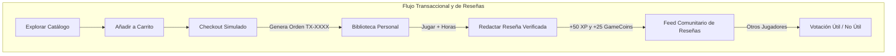
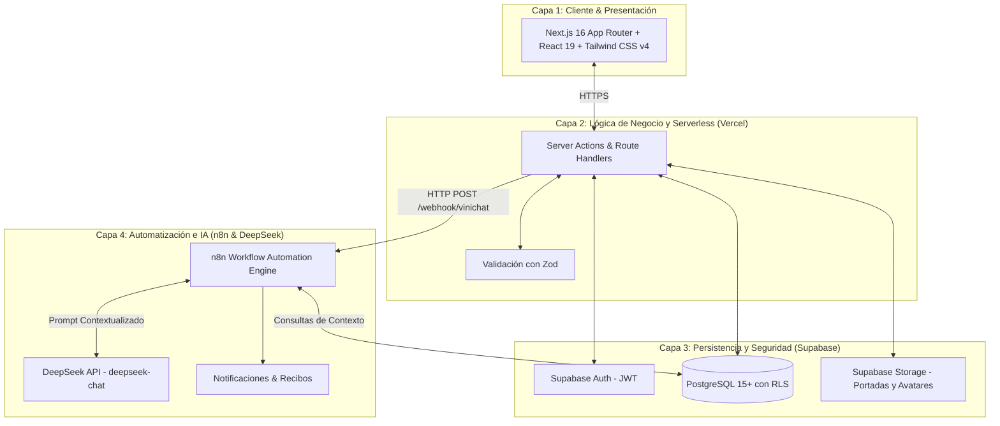
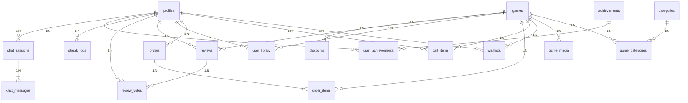
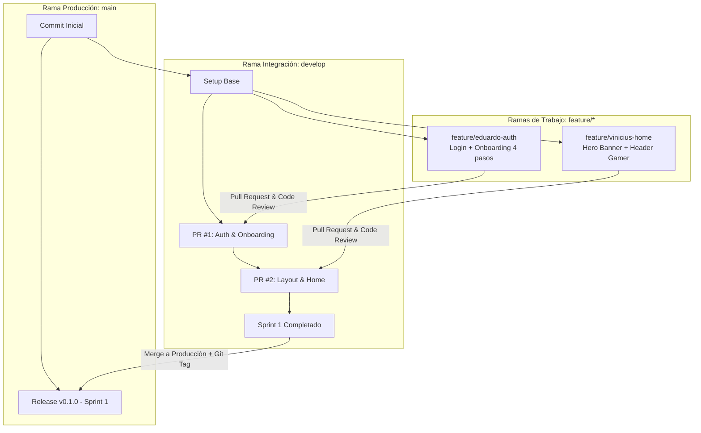

# 🎮 SISTEMA WEB PARA VENTA DIGITAL Y GESTIÓN DE VIDEOJUEGOS (VINIGAMES)
## INFORME TÉCNICO Y ESPECIFICACIÓN DE REQUERIMIENTOS DE SOFTWARE (SRS)

> **Universidad Tecnológica Privada de Santa Cruz (UTEPSA)**  
> **Facultad de Tecnología** — *Carrera: Ingeniería en Sistemas*  
> **Materia**: Desarrollo de Aplicaciones Web  
> **Docente**: Ing. Bryana Ojopi Banegas  
> **Santa Cruz de la Sierra — Bolivia | Gestión: 2026**  
>
> **Integrantes del Equipo de Desarrollo**:  
> 1. **Vinicius Montibeller**  
> 2. **Sergio Alvarez**  
> 3. **Shaimme Zelada**  
> 4. **Eduardo Ribera**  
> 5. **Jose Alberto Rios**  

---

## 📑 ÍNDICE GENERAL DEL PROYECTO

1. [INTRODUCCIÓN](#1-introducción)
   - 1.1. Descripción del proyecto
   - 1.2. Alcance del sistema (Módulos incluidos y no incluidos)
   - 1.3. Matriz de priorización MoSCoW
   - 1.4. Indicadores clave de rendimiento (KPIs)
2. [PLANTEAMIENTO DEL PROBLEMA Y JUSTIFICACIÓN](#2-planteamiento-del-problema-y-justificación)
   - 2.1. Situación actual
   - 2.2. Consecuencias
   - 2.3. Necesidad identificada
   - 2.4. Formulación del problema
   - 2.5. Justificación
3. [OBJETIVOS DEL PROYECTO](#3-objetivos-del-proyecto)
   - 3.1. Objetivo general
   - 3.2. Objetivos específicos
4. [USUARIOS Y REQUERIMIENTOS DEL SISTEMA](#4-usuarios-y-requerimientos-del-sistema)
   - 4.1. Identificación y roles de usuario (RBAC)
   - 4.2. Matriz de requerimientos funcionales (RF-01 a RF-20)
   - 4.3. Matriz de requerimientos no funcionales (RNF-01 a RNF-12)
   - 4.4. Historias de usuario y criterios de aceptación (HU001 a HU014)
5. [DISEÑO FUNCIONAL Y AUDITORÍA UX/UI](#5-diseño-funcional-y-auditoría-uxui)
   - 5.1. Identidad visual y Design System (Dark Gamer Theme)
   - 5.2. Mapeo exhaustivo de las 15 pantallas y vistas de Figma
   - 5.3. Flujos de interacción y diagramas de secuencia
6. [ARQUITECTURA DEL SISTEMA Y TECNOLOGÍAS](#6-arquitectura-del-sistema-y-tecnologías)
   - 6.1. Arquitectura general desacoplada
   - 6.2. Stack tecnológico y justificación técnica
   - 6.3. Orquestación de n8n como motor de automatización y middleware
   - 6.4. Asistente inteligente ViniChat con DeepSeek API
7. [DISEÑO DE BASE DE DATOS REESTRUCTURADO](#7-diseño-de-base-de-datos-reestructurado)
   - 7.1. Identificación de entidades del dominio de datos (20 tablas)
   - 7.2. Diagrama Entidad-Relación (DER)
   - 7.3. Diccionario de datos de PostgreSQL en Supabase
   - 7.4. Políticas de Row Level Security (RLS) y Triggers automatizados
8. [MOTOR DE GAMIFICACIÓN Y ALGORITMOS](#8-motor-de-gamificación-y-algoritmos)
   - 8.1. Perfil analítico Gamer DNA
   - 8.2. Progresión matemática de niveles por XP
   - 8.3. Algoritmo de cálculo de rachas de conexión diaria
   - 8.4. Economía virtual en GameCoins y catálogo de medallas
9. [ESTRUCTURA DEL SISTEMA DE ARCHIVOS Y CÓDIGO](#9-estructura-del-sistema-de-archivos-y-código)
   - 9.1. Mapa de directorios de Next.js 16
   - 9.2. Esquemas de validación Zod y Server Actions
10. [PLAN DE IMPLEMENTACIÓN Y ASIGNACIÓN DE ROLES](#10-plan-de-implementación-y-asignación-de-roles)
    - 10.1. Cronograma de 4 Sprints
    - 10.2. Desglose de tareas por integrante
11. [GUÍA DE CONTROL DE VERSIONES (GIT & GITHUB)](#11-guía-de-control-de-versiones-git--github)
    - 11.1. Flujo de trabajo en ramas (GitHub Flow)
    - 11.2. Convención de commits y versionado con Git Tags

---

## 📌 1. INTRODUCCIÓN

### 1.1. Descripción del proyecto
**ViniGames** es una plataforma web moderna de comercio electrónico digital, descubrimiento asistido por Inteligencia Artificial y gestión comunitaria de videojuegos para PC y consolas. Nace para solucionar la dispersión de información y la falta de personalización en las tiendas tradicionales, unificando en un solo entorno el catálogo de títulos, la interacción social de los jugadores, la simulación de compras y un asistente virtual conversacional impulsado por **DeepSeek API** y orquestado mediante **n8n**.

### 1.2. Alcance del sistema
Para garantizar una ejecución técnica rigurosa dentro de los plazos académicos de la materia *Desarrollo de Aplicaciones Web*, se definen con precisión los límites del sistema:

#### Tabla 1: Alcance del Proyecto - Funcionalidades Incluidas y No Incluidas
| Módulos y Funcionalidades INCLUIDAS | Aspectos y Funcionalidades NO INCLUIDAS |
| :--- | :--- |
| • Autenticación y Onboarding de 4 pasos con Supabase Auth (Roles: Visitante, Gamer, Administrador). • Catálogo interactivo de videojuegos con filtros múltiples, búsqueda y ordenamiento. • Asistente virtual (ViniChat con DeepSeek + n8n) para recomendaciones personalizadas según Gamer DNA. • Módulo de Lista de Deseos (Wishlist) y Carrito de Compras reactivo. • Simulación de checkout transaccional y emisión de comprobante digital. • Biblioteca personal para gestión de títulos adquiridos, horas jugadas y estado de instalación. • Sistema de reseñas con calificación (1 a 5) exclusivo para compradores verificados. • Votación comunitaria de utilidad (*Helpful / Unhelpful*) en reseñas. • Motor de Gamificación: cálculo de rachas diarias de 7 días, niveles por XP, medallas y GameCoins. • Panel Administrativo (ViniAdmin) con KPIs, CRUD de catálogo, auditoría y exportación CSV. • Despliegue continuo en Vercel conectado a base de datos PostgreSQL 15+ en Supabase. | • Integración con pasarelas de pago bancarias reales en producción con cobro a tarjetas reales (se maneja simulación transaccional estructurada). • Servicio de almacenamiento masivo y descarga directa de binarios ejecutables de videojuegos (50GB+ CDN de distribución). • Soporte nativo para plataformas de consola física propietarias (PlayStation Network, Xbox Live, Nintendo eShop). • Procesamiento de streaming de videojuegos en la nube (*Cloud Gaming* / renderizado en servidor). |

### 1.3. Matriz de priorización MoSCoW
- **Must Have**: Auth con Supabase, Onboarding 4 pasos, Catálogo con filtros, Detalle de juego, Carrito y Checkout simulado, Biblioteca, Reseñas verificadas, Panel Admin CRUD y PostgreSQL con RLS.
- **Should Have**: ViniChat con DeepSeek y n8n, Rachas diarias de 7 días, XP y niveles, Votación de utilidad en reseñas, Dashboard con métricas KPIs en ViniAdmin.
- **Could Have**: Envío de recibos por email vía n8n, canje de GameCoins por avatares cosméticos, exportación CSV avanzada, debounce en buscador.
- **Won't Have**: Cobro bancario real, distribución de instaladores de 50GB+, integración con hardware de consolas, Cloud Gaming.

### 1.4. Indicadores clave de rendimiento (KPIs)
- Tiempo de carga inicial (FCP/LCP): $< 1.8 \text{ segundos}$.
- Tasa de conversión de Onboarding: $> 85\%$ de finalización del paso 1 al 4.
- Latencia de respuesta de ViniChat: $< 2.5 \text{ segundos}$ vía Webhook n8n.
- Integridad transaccional: $100\%$ de consistencia en órdenes y biblioteca mediante triggers ACID.

---

## 🔍 2. PLANTEAMIENTO DEL PROBLEMA Y JUSTIFICACIÓN

### 2.1. Situación actual
Actualmente, los usuarios interesados en videojuegos utilizan diferentes plataformas para buscar y adquirir títulos, consultar información y conocer las opiniones de otros jugadores. Esta distribución fragmentada dificulta el descubrimiento de videojuegos que se adapten a los gustos individuales. Asimismo, la participación comunitaria se ve limitada por la falta de incentivos que reconozcan el aporte de valor (reseñas y análisis).

### 2.2. Consecuencias
Inversión excesiva de tiempo en búsqueda de títulos, compras insatisfactorias por falta de orientación personalizada y baja tasa de retención activa en las plataformas.

### 2.3. Necesidad identificada
Se identifica la necesidad de centralizar en un ecosistema web unificado el catálogo comercial, un asistente inteligente que interprete la psicología de juego del usuario (*Gamer DNA*), una biblioteca interactiva y dinámicas de gamificación que premien la interacción continua.

### 2.4. Formulación del problema
> ¿De qué manera el desarrollo de una plataforma web integral basada en Next.js, Supabase y PostgreSQL, que incorpore asistencia personalizada por Inteligencia Artificial y dinámicas de gamificación comunitaria, permite optimizar el proceso de descubrimiento, adquisición, gestión y valoración de videojuegos para la comunidad de jugadores?

### 2.5. Justificación
- **Utilidad y Valor Práctico**: Centraliza la experiencia de compra, biblioteca y retroalimentación en una sola aplicación web de alto rendimiento.
- **Impacto Comunitario y Gamificación**: Motiva la participación constructiva mediante rachas diarias, niveles de experiencia, medallas y economía virtual.
- **Innovación Tecnológica**: La integración de DeepSeek API y n8n como middleware sitúa al proyecto a la vanguardia de las aplicaciones web modernas.

---

## 🎯 3. OBJETIVOS DEL PROYECTO

### 3.1. Objetivo general
Desarrollar una plataforma web para la gestión y compra de videojuegos en línea, integrando funcionalidades de comunidad y gamificación que permitan mejorar la experiencia e interacción de los usuarios.

### 3.2. Objetivos específicos
1. Establecer un sistema de autenticación seguro con Supabase Auth y Onboarding gamificado en 4 etapas.
2. Desarrollar un sistema de compra simulada, catálogo reactivo y emisión de comprobante digital.
3. Diseñar una biblioteca digital personal para organizar títulos, consultar horas jugadas y alternar estados de instalación.
4. Implementar un sistema de reseñas exclusivas para compradores verificados con votación de utilidad comunitaria.
5. Incorporar un motor de gamificación basado en rachas diarias de 7 días, cálculo matemático de niveles por XP, saldo GameCoins y medallas.
6. Integrar el asistente virtual ViniChat orquestado con n8n y DeepSeek API para brindar soporte y recomendaciones guiadas por el Gamer DNA.
7. Construir un panel administrativo (ViniAdmin) con métricas KPIs, CRUD de catálogo y auditoría transaccional.

---

## 👥 4. USUARIOS Y REQUERIMIENTOS DEL SISTEMA

### 4.1. Identificación y roles de usuario (RBAC)

#### Tabla 2: Identificación y Roles de Usuarios del Sistema
| Usuario / Rol | Descripción y Alcance de Acceso | Privilegios Principales |
| :--- | :--- | :--- |
| **Visitante (Público)** | Persona no autenticada que explora el catálogo público. | • Explorar Home y Catálogo. • Buscar y filtrar títulos. • Consultar fichas técnicas y precios. • Iniciar sesión / Registrarse. |
| **Usuario Registrado (Gamer)** | Cliente autenticado con cuenta activa y perfil Gamer DNA. | • Gestión de perfil y avatar. • Carrito, Wishlist y Checkout simulado. • Mi Biblioteca (Jugar, Horas jugadas). • Publicar reseñas verificadas y votar utilidad. • Uso de ViniChat Asistente IA. • Ganar XP, subir nivel y rachas de 7 días. |
| **Administrador (ViniAdmin)** | Personal autorizado encargado de la administración operativa. | • Dashboard con KPIs de negocio en tiempo real. • CRUD completo de juegos y categorías. • Gestión y programación de descuentos. • Auditoría de ventas y exportación CSV. • Moderación de reseñas comunitarias. • Supervisión de usuarios y asignación de roles. |

---

### 4.2. Matriz de requerimientos funcionales (RF-01 a RF-20)

#### Tabla 3: Matriz de Requerimientos Funcionales
| Código | Requerimiento | Descripción Detallada |
| :---: | :--- | :--- |
| **RF-01** | Autenticación y Registro | Registro de nuevas cuentas, inicio de sesión seguro, cierre de sesión y recuperación de contraseña vía Supabase Auth. |
| **RF-02** | Gestión de Perfil | Consultar y actualizar datos de perfil, avatar gráfico, correo, biografía y ponderación del Gamer DNA. |
| **RF-03** | Asistente Virtual IA | Interactuar con ViniChat en lenguaje natural para recibir recomendaciones y soporte técnico orquestado por n8n y DeepSeek. |
| **RF-04** | Catálogo y Detalle | Visualizar catálogo completo con fichas técnicas (título, precio, sinopsis, trailers, desarrollador). |
| **RF-05** | Búsqueda y Filtros | Búsqueda por texto con debounce y filtros combinados por categorías múltiples, precio y rebajas. |
| **RF-06** | Lista de Deseos | Agregar, consultar y remover títulos favoritos con alerta visual de promociones vigentes. |
| **RF-07** | Gestión de Carrito | Añadir, eliminar y gestionar videojuegos dentro del carrito de compras activo. |
| **RF-08** | Cálculo de Descuentos | Cálculo automático del subtotal, rebajas promocionales aplicadas y total final en Bolivianos (Bs.). |
| **RF-09** | Simulación de Compra | Procesar orden de compra con tarjeta de prueba virtual y emitir el recibo transaccional digital. |
| **RF-10** | Biblioteca de Juegos | Consultar títulos adquiridos con estado de instalación (`NOT_INSTALLED`, `INSTALLED`) y contador de horas jugadas. |
| **RF-11** | Publicación de Reseñas | Calificar (1 a 5 estrellas) y redactar reseñas restringidas estrictamente a compradores comprobados (+50 XP). |
| **RF-12** | Edición de Reseñas | Modificar o eliminar reseñas publicadas por el propio usuario. |
| **RF-13** | Votación de Utilidad | Votar si una reseña comunitaria resultó útil (*Helpful / Unhelpful*) con restricción de voto único. |
| **RF-14** | Rachas y Gamificación | Registrar conexiones diarias consecutivas (1 a 7 días), calcular nivel exponencial por XP y otorgar medallas. |
| **RF-15** | CRUD de Videojuegos | Registrar, modificar información técnica, dar de baja lógica y gestionar categorías del catálogo comercial. |
| **RF-16** | Gestión de Descuentos | Crear porcentajes de rebaja y programar fechas de vigencia para promociones temporales. |
| **RF-17** | Gestión de Usuarios | Listar usuarios registrados, supervisar estados y asignar roles del sistema (`USER` / `ADMIN`). |
| **RF-18** | Moderación de Reseñas | Supervisar opiniones de la comunidad, aprobar, rechazar u ocultar comentarios inapropiados. |
| **RF-19** | Auditoría de Compras | Consultar el registro inmutable de todas las transacciones con filtros por estado, fecha y usuario. |
| **RF-20** | Generación de Reportes | Visualizar KPIs consolidados de ventas y actividad, con exportación de registros en formato CSV. |

---

### 4.3. Matriz de requerimientos no funcionales (RNF-01 a RNF-12)

#### Tabla 4: Matriz de Requerimientos No Funcionales
| Código | Requerimiento No Funcional | Criterio de Cumplimiento Técnico |
| :---: | :--- | :--- |
| **RNF-01** | Interfaz Estética e Inmersiva | Maquetación con **Tailwind CSS v4** basada en el tema oscuro gamer (*Dark Gamer Theme*). |
| **RNF-02** | Diseño Responsivo | Adaptación fluida a computadoras de escritorio, tablets y smartphones (*Mobile-First*). |
| **RNF-03** | Compatibilidad de Navegadores | Soporte garantizado en Google Chrome, Microsoft Edge, Mozilla Firefox y Safari. |
| **RNF-04** | Seguridad y Cifrado RBAC | Autenticación con JWTs cifrados y políticas de *Row Level Security (RLS)* en PostgreSQL. |
| **RNF-05** | Validación Estricta de Datos | Validación de esquemas en cliente y servidor con **Zod** y TypeScript antes de persistir. |
| **RNF-06** | Integridad Transaccional ACID | Transacciones atómicas en PostgreSQL con claves foráneas, índices y reglas en cascada. |
| **RNF-07** | Rendimiento y Carga Rápida | Tiempos de carga iniciales $< 1.8\text{s}$ mediante React Server Components (RSC) y SSR. |
| **RNF-08** | Arquitectura Serverless | Backend desacoplado en Server Actions de Next.js y webhooks de automatización en n8n. |
| **RNF-09** | Código Limpio y Tipado Estricto | TypeScript con configuración estricta, cero tipos `any` y reglas de ESLint 9. |
| **RNF-10** | Frameworks de Vanguardia | Uso obligatorio del estándar **Next.js 16** con **React 19**. |
| **RNF-11** | Persistencia en Supabase | Base de datos relacional PostgreSQL 15+ administrada en la nube con Supabase. |
| **RNF-12** | Despliegue Continuo en Vercel | Integración continua (CI/CD) alojada en la red perimetral global de Vercel. |

---

### 4.4. Historias de usuario (HU001 a HU014)

#### Tabla 5: Historias de Usuario - Visitante (HU001 a HU004)
| Código | Título / Actor / Encargado | Detalle de la Historia de Usuario | Criterios de Aceptación |
| :---: | :--- | :--- | :--- |
| **HU001** | **Explorar contenido** Actor: Visitante Encargado: Vinicius M. | Como visitante, quiero explorar el catálogo y juegos destacados, para conocer la oferta de ViniGames. | El Home debe mostrar el Hero Banner dinámico (*Neon Odyssey*), carrusel de ofertas y selector rápido de categorías. |
| **HU002** | **Consultar detalles de juego** Actor: Visitante Encargado: Sergio A. | Como visitante, quiero ver la ficha técnica y precio de cada juego, para conocer sus características antes de comprar. | Debe mostrar sinopsis, trailers, desarrollador, capturas HD, clasificación por edad y precio base/rebajado. |
| **HU003** | **Búsqueda y filtros** Actor: Visitante Encargado: Shaimme Z. | Como visitante, quiero buscar por texto y filtrar por géneros, para encontrar rápido mis preferencias. | Los resultados deben actualizarse instantáneamente con debounce al teclear o seleccionar categorías. |
| **HU004** | **Registro de cuenta** Actor: Visitante Encargado: Eduardo R. | Como visitante, quiero crear una cuenta mediante un onboarding guiado, para acceder a funciones exclusivas. | Flujo de 4 pasos obligatorios (Avatar, Géneros, Gamer DNA, Credenciales) validado con Zod y Supabase Auth. |

#### Tabla 6: Historias de Usuario - Usuario Registrado (HU005 a HU009)
| Código | Título / Actor / Encargado | Detalle de la Historia de Usuario | Criterios de Aceptación |
| :---: | :--- | :--- | :--- |
| **HU005** | **Gestionar perfil** Actor: Gamer Encargado: Jose Alberto R. | Como usuario registrado, quiero editar mis datos y avatar, para mantener actualizada mi identidad. | Edición de avatar, biografía y visualización del gráfico de radar con los 4 arquetipos de Gamer DNA. |
| **HU006** | **Comprar videojuegos** Actor: Gamer Encargado: Vinicius M. | Como usuario registrado, quiero agregar juegos al carrito y realizar la compra simulada, para obtener mis licencias. | Cálculo automático de subtotales, simulación con tarjeta virtual de prueba y emisión de recibo digital `TX-XXXX`. |
| **HU007** | **Consultar compras** Actor: Gamer Encargado: Sergio A. | Como usuario registrado, quiero ver mi historial transaccional, para llevar control de mis pedidos. | Listado cronológico con código `TX-XXXX`, fecha, monto pagado en Bs. y estado de la orden. |
| **HU008** | **Reseñas y Gamificación** Actor: Gamer Encargado: Eduardo R. | Como usuario registrado, quiero publicar opiniones sobre juegos adquiridos, para ganar XP y subir de nivel. | Solo compradores comprobados pueden opinar. Cada reseña aprobada otorga $+50 \text{ XP}$ y $+25 \text{ GameCoins}$. |
| **HU009** | **Consultar biblioteca** Actor: Gamer Encargado: Shaimme Z. | Como usuario registrado, quiero acceder a mi biblioteca digital, para gestionar mis títulos adquiridos. | Grid con estado de instalación, contador de horas jugadas y botón `▶ Jugar` para simular ejecución. |

#### Tabla 7: Historias de Usuario - Administrador (HU010 a HU014)
| Código | Título / Actor / Encargado | Detalle de la Historia de Usuario | Criterios de Aceptación |
| :---: | :--- | :--- | :--- |
| **HU010** | **Gestionar usuarios** Actor: Admin Encargado: Eduardo R. | Como administrador, quiero supervisar las cuentas registradas, para mantener el control de acceso. | Búsqueda de usuarios, cambio de roles (`ADMIN`/`USER`) y bloqueo de cuentas infractoras. |
| **HU011** | **Gestionar catálogo** Actor: Admin Encargado: Vinicius M. | Como administrador, quiero crear, editar y dar de baja juegos y categorías, para mantener actualizado el catálogo. | Formulario con carga de imágenes a Supabase Storage, asignación de categorías múltiples y precios. |
| **HU012** | **Auditoría de ventas** Actor: Admin Encargado: Sergio A. | Como administrador, quiero consultar todas las compras realizadas, para supervisar los ingresos. | Filtros por fecha, estado transaccional y exportación de registros a archivo CSV. |
| **HU013** | **Moderar contenido** Actor: Admin Encargado: Jose Alberto R. | Como administrador, quiero moderar reseñas comunitarias, para garantizar un ambiente seguro y libre de spam. | Cola de moderación con opciones de aprobar, rechazar o eliminar comentarios. |
| **HU014** | **Reportes estadísticos** Actor: Admin Encargado: Shaimme Z. | Como administrador, quiero visualizar métricas del sistema, para analizar el crecimiento del negocio. | KPIs de ventas mensuales, usuarios activos, títulos publicados y gráfica de transacciones en el tiempo. |

---

## 🎨 5. DISEÑO FUNCIONAL Y AUDITORÍA UX/UI

### 5.1. Identidad visual y Design System (Dark Gamer Theme)
El diseño de ViniGames adopta una estética **Dark Gamer Cyberpunk Minimalista**, optimizada para sesiones prolongadas de uso:
- **Fondo Base Principal**: `#090B14` (zinc-950).
- **Superficie de Tarjetas**: `#1A1C2B` (zinc-900).
- **Bordes Activos**: `#2E334A` (zinc-800).
- **Acento Violeta Neón**: `#783DF2` (Botones primarios, barras de XP, destacados).
- **Acento Cian Brillante**: `#1FD1EB` (Saldo de GameCoins, medallas).
- **Acento Esmeralda**: `#10B981` (Rachas activas, precios rebajados, estado completado).
- **Tipografía**: *Inter* y *Geist Sans* (Alta legibilidad, números tabulares).

---

### 5.2. Mapeo de las 15 Pantallas y Vistas del Prototipo Figma

| Nro | Vista / Pantalla | Ruta | Componentes Clave | Interacción Principal |
| :---: | :--- | :--- | :--- | :--- |
| **01** | **Inicio de Sesión** | `/login` | Formulario con inputs de email y password, botón Supabase Auth. | Validación Zod y redirección según rol. |
| **02** | **Onboarding Paso 1** | `/onboarding/step-1` | Selector interactivo de avatar gráfico y nombre de usuario gamer. | Validación de username único en tiempo real. |
| **03** | **Onboarding Paso 2** | `/onboarding/step-2` | Grid de categorías temáticas (Acción, RPG, Terror, Indie, etc.). | Selección múltiple con contador de seleccionados. |
| **04** | **Onboarding Paso 3** | `/onboarding/step-3` | 4 Tarjetas de estilo de juego (Explorador, Competitivo, Narrativo, Coleccionista). | Ponderación de porcentajes del Gamer DNA. |
| **05** | **Onboarding Paso 4** | `/onboarding/step-4` | Formulario de credenciales con validación de seguridad. | Creación en `auth.users` y sincronización en `profiles`. |
| **06** | **Bienvenida Gamer** | `/onboarding/welcome` | Modal festivo "¡Misión Completada!", Nivel 1 asignado, +100 XP. | Animación de confeti y redirección al Home. |
| **07** | **Página Principal (Home)** | `/` | Hero Banner (*Neon Odyssey*), carrusel de ofertas, catálogo Gamer DNA, widget de racha. | Navegación reactiva con Server Components. |
| **08** | **ViniChat Asistente IA** | `/chat` | Sidebar de temas, ventana de chat en Markdown, tarjetas de compra embebidas. | Orquestación mediante Webhook n8n + DeepSeek API. |
| **09** | **Dashboard ViniAdmin** | `/admin` | Tarjetas de KPIs (Ventas Bs., Usuarios, Juegos, Retención), gráfica de ingresos. | Monitoreo administrativo en tiempo real. |
| **10** | **Admin: Registro de Ventas** | `/admin/sales` | Tabla de transacciones con filtros por estado y selector de fechas. | Exportación de auditoría en formato CSV. |
| **11** | **Biblioteca de Videojuegos**| `/library` | Grid de juegos en posesión, filtros (*Todos, Instalados, Recientes*), botón `▶ Jugar`. | Simulación de ejecución y horas jugadas. |
| **12** | **Lista de Deseos** | `/wishlist` | Títulos guardados, alerta de rebaja temporal, botón "Mover al carrito". | Actualización optimista en cliente. |
| **13** | **Panel de Gamificación** | `/gamification` | Calendario de racha de 7 días, barra de XP animada, galería de medallas por categorías. | Visualización de progreso y logros. |
| **14** | **Perfil Gamer** | `/profile` | Avatar, nivel, saldo GameCoins, gráfico visual de Gamer DNA, juegos recientes. | Modal de edición de datos personales. |
| **15** | **Ficha de Detalle de Juego**| `/games/[slug]` | Hero con trailer, galería de capturas, caja de compra, feed de reseñas verificadas y votos. | Compra directa o adición a la Wishlist. |

---

### 5.3. Flujos de Interacción del Sistema

---

## 🏛️ 6. ARQUITECTURA DEL SISTEMA Y TECNOLOGÍAS

### 6.1. Arquitectura General Desacoplada

---

### 6.2. Stack Tecnológico y Justificación Técnica

#### Tabla 8: Stack Tecnológico y Justificación Técnica
| Herramienta / Tecnología | Versión / Rol | Justificación de Elección Técnica en el Proyecto |
| :--- | :--- | :--- |
| **Next.js** | `v16.3.0` (App Router) | Framework React de vanguardia para SSR/SSG, Server Components para carga ultra-rápida y Server Actions seguras. |
| **React** | `v19.2.8` | Librería reactiva moderna con soporte para Actions asíncronas concurrentes y hooks (`useActionState`, `useOptimistic`). |
| **Tailwind CSS** | `v4.0` | Framework CSS utilitario para maquetación responsiva acelerada, diseño oscuro inmersivo y cero bloat CSS. |
| **Supabase** | BaaS Cloud (PostgreSQL 15+) | Solución integral de backend que proporciona base de datos relacional ACID, Auth con JWTs, políticas RLS y Storage. |
| **PostgreSQL** | `v15+` (Relacional) | Motor relacional robusto con transacciones ACID, integridad referencial con claves foráneas e índices optimizados. |
| **DeepSeek API** | LLM API (`deepseek-chat`) | Modelo de lenguaje de alto rendimiento para el asistente ViniChat, recomendaciones basadas en Gamer DNA y moderación. |
| **n8n** | Automation Engine | Motor de orquestación desacoplado que actúa como middleware entre Next.js, DeepSeek y Supabase para tareas en segundo plano. |
| **Vercel** | Edge Network / Hosting | Despliegue global en servidores perimetrales de baja latencia con integración y despliegue continuo (CI/CD) desde Git. |

---

## 🗄️ 7. DISEÑO DE BASE DE DATOS REESTRUCTURADO

### 7.1. Identificación de Entidades del Dominio de Datos (20 Tablas)

#### Tabla 9: Identificación de Entidades del Dominio de Datos Reestructurado
| Entidad | Descripción | Requerimientos Relacionados |
| :--- | :--- | :--- |
| **profiles** | Datos públicos y gamer vinculados a `auth.users`, incluyendo avatar, Gamer DNA, nivel, XP, racha y GameCoins. | RF-01, RF-02, RF-14, RF-17 |
| **categories** | Clasificación temática de los videojuegos (Acción, RPG, Aventura, Indie, Estrategia, etc.). | RF-04, RF-05, RF-15 |
| **games** | Catálogo con precios, descuentos, ficha técnica, enlaces multimedia y promedio de estrellas. | RF-04, RF-05, RF-08, RF-15 |
| **game_categories** | Tabla asociativa (N:M) que permite asignar múltiples géneros temáticos a un mismo videojuego. | RF-04, RF-05, RF-15 |
| **game_media** | Galería de capturas de pantalla adicionales y enlaces de trailers para la ficha técnica. | RF-04, RF-15 |
| **wishlists** | Registra los videojuegos favoritos guardados por los usuarios para monitorear ofertas. | RF-06 |
| **cart_items** | Títulos seleccionados por el usuario para su adquisición en la sesión activa. | RF-07, RF-08 |
| **orders** | Transacciones completadas con código público (ej: `TX-9400`), totales, descuentos y estado. | RF-08, RF-09, RF-19, RF-20 |
| **order_items** | Desglose de cada videojuego incluido en una orden con su precio y descuento unitario. | RF-09, RF-19 |
| **user_library** | Títulos adquiridos por el usuario, su estado de instalación y horas jugadas acumuladas. | RF-09, RF-10 |
| **reviews** | Opiniones y calificaciones (1 a 5 estrellas) redactadas por compradores verificados. | RF-11, RF-12, RF-18 |
| **review_votes** | Valoración comunitaria (*Útil / No Útil*) que otros jugadores otorgan a una reseña específica. | RF-13 |
| **discounts** | Reglas de descuento temporales programadas con fechas de inicio y vencimiento. | RF-08, RF-16 |
| **streak_logs** | Historial diario de conexiones a la plataforma para el cálculo y mantenimiento de la racha. | RF-14 |
| **achievements** | Catálogo de medallas y logros disponibles con recompensas en XP y GameCoins. | RF-14 |
| **user_achievements** | Medallas y logros que cada usuario ha completado dentro del sistema. | RF-14 |
| **chat_sessions** | Hilos de conversación entre el usuario y el Asistente Virtual ViniChat. | RF-03 |
| **chat_messages** | Mensajes individuales con soporte para metadatos JSON de productos recomendados. | RF-03 |
| **admin_audit_logs** | Registro inmutable de acciones críticas ejecutadas por administradores. | RF-17, RF-18, RF-19 |
| **game_tags** | Etiquetas descriptivas complementarias para enriquecimiento del catálogo. | RF-04, RF-05 |

---

### 7.2. Diagrama Entidad-Relación (DER)

---

### 7.3. Diccionario de Datos Completo (PostgreSQL)

#### Tabla 10: Diccionario de Datos Completo de PostgreSQL en Supabase
| Tabla | Campo | Tipo | Clave | Restricciones / Descripción |
| :--- | :--- | :--- | :---: | :--- |
| **profiles** | `id` | `UUID` | PK, FK | `REFERENCES auth.users(id) ON DELETE CASCADE`. Identificador de cuenta. |
| **profiles** | `role` | `user_role` (ENUM) | — | `'VISITOR'`, `'USER'`, `'ADMIN'`. Por defecto: `'USER'`. |
| **profiles** | `username` | `VARCHAR(50)` | UNIQUE | Nombre público único del gamer (ej: `@eduardo_gamer`). |
| **profiles** | `avatar_url` | `TEXT` | — | Ruta de imagen de avatar personalizada. |
| **profiles** | `gamecoins_balance`| `INTEGER` | — | `CHECK (gamecoins_balance >= 0)`. Saldo virtual (Default: 100). |
| **profiles** | `total_xp` | `INTEGER` | — | `CHECK (total_xp >= 0)`. Puntos de experiencia acumulados. |
| **profiles** | `current_level` | `INTEGER` | — | `CHECK (current_level >= 1)`. Nivel de progresión del jugador. |
| **profiles** | `current_streak` | `INTEGER` | — | Días consecutivos de conexión activa. |
| **profiles** | `dna_exploration` | `SMALLINT` | — | Ponderación de estilo Explorador (0 a 100%). |
| **profiles** | `dna_competitive` | `SMALLINT` | — | Ponderación de estilo Competitivo (0 a 100%). |
| **profiles** | `dna_narrative` | `SMALLINT` | — | Ponderación de estilo Narrativo (0 a 100%). |
| **profiles** | `dna_collection` | `SMALLINT` | — | Ponderación de estilo Coleccionista (0 a 100%). |
| **categories** | `id` | `SERIAL` | PK | Identificador único de la categoría. |
| **categories** | `name` | `VARCHAR(50)` | UNIQUE | Nombre de la categoría (ej: *RPG*, *Acción*). |
| **categories** | `slug` | `VARCHAR(60)` | UNIQUE | Enlace URL amigable de la categoría. |
| **games** | `id` | `SERIAL` | PK | Identificador numérico del videojuego. |
| **games** | `title` | `VARCHAR(150)` | — | Título comercial del juego. |
| **games** | `slug` | `VARCHAR(180)` | UNIQUE | URL amigable del juego (ej: `neon-odyssey`). |
| **games** | `base_price` | `DECIMAL(10,2)`| — | `CHECK (base_price >= 0)`. Precio regular en Bs. |
| **games** | `discount_percent`| `SMALLINT` | — | Porcentaje de rebaja aplicada (0 a 100). |
| **games** | `final_price` | `DECIMAL(10,2)`| — | `GENERATED ALWAYS AS (base_price * (1 - discount/100)) STORED`. |
| **games** | `cover_image_url` | `TEXT` | — | URL de portada en Supabase Storage. |
| **games** | `rating_avg` | `DECIMAL(3,2)`| — | Promedio acumulado de estrellas (0.00 a 5.00). |
| **game_categories**| `game_id` | `INTEGER` | PK, FK | `REFERENCES games(id) ON DELETE CASCADE`. |
| **game_categories**| `category_id` | `INTEGER` | PK, FK | `REFERENCES categories(id) ON DELETE CASCADE`. |
| **orders** | `id` | `SERIAL` | PK | Identificador único de la orden. |
| **orders** | `order_code` | `VARCHAR(30)` | UNIQUE | Código público de transacción (ej: `TX-9401`). |
| **orders** | `user_id` | `UUID` | FK | `REFERENCES profiles(id) ON DELETE RESTRICT`. |
| **orders** | `total` | `DECIMAL(10,2)`| — | Importe total cobrado en la compra simulada. |
| **orders** | `status` | `order_status_type`| — | `'COMPLETED'`, `'PENDING'`, `'FAILED'`, `'CANCELLED'`. |
| **order_items** | `id` | `SERIAL` | PK | Identificador del ítem ordenado. |
| **order_items** | `order_id` | `INTEGER` | FK | `REFERENCES orders(id) ON DELETE CASCADE`. |
| **order_items** | `game_id` | `INTEGER` | FK | `REFERENCES games(id) ON DELETE RESTRICT`. |
| **order_items** | `final_price` | `DECIMAL(10,2)`| — | Precio final cobrado por el título. |
| **user_library** | `id` | `SERIAL` | PK | Identificador del registro de biblioteca. |
| **user_library** | `user_id` | `UUID` | FK | `REFERENCES profiles(id) ON DELETE CASCADE`. |
| **user_library** | `game_id` | `INTEGER` | FK | `REFERENCES games(id) ON DELETE RESTRICT`. |
| **user_library** | `install_status` | `install_status_type`| — | `'NOT_INSTALLED'`, `'INSTALLING'`, `'INSTALLED'`, `'READY_TO_PLAY'`. |
| **user_library** | `hours_played` | `DECIMAL(6,1)` | — | Contador acumulado de horas de juego registradas. |
| **reviews** | `id` | `SERIAL` | PK | Identificador único de la reseña. |
| **reviews** | `user_id` | `UUID` | FK | `REFERENCES profiles(id) ON DELETE CASCADE`. |
| **reviews** | `game_id` | `INTEGER` | FK | `REFERENCES games(id) ON DELETE CASCADE`. |
| **reviews** | `rating` | `SMALLINT` | — | `CHECK (rating BETWEEN 1 AND 5)`. Estrellas otorgadas. |
| **reviews** | `content` | `TEXT` | — | Análisis y opinión redactada por el comprador. |
| **reviews** | `helpful_votes_count`| `INTEGER` | — | Total de votos útiles recibidos de la comunidad. |
| **review_votes** | `id` | `SERIAL` | PK | Identificador del voto. |
| **review_votes** | `review_id` | `INTEGER` | FK | `REFERENCES reviews(id) ON DELETE CASCADE`. |
| **review_votes** | `user_id` | `UUID` | FK | `REFERENCES profiles(id) ON DELETE CASCADE`. |
| **review_votes** | `is_helpful` | `BOOLEAN` | — | `true` para útil, `false` para no útil. `UNIQUE (review_id, user_id)`. |
| **streak_logs** | `id` | `SERIAL` | PK | Identificador del registro de racha. |
| **streak_logs** | `user_id` | `UUID` | FK | `REFERENCES profiles(id) ON DELETE CASCADE`. |
| **streak_logs** | `activity_date`| `DATE` | — | Fecha de conexión registrada. `UNIQUE (user_id, activity_date)`. |
| **achievements** | `id` | `SERIAL` | PK | Identificador de la medalla. |
| **achievements** | `code` | `VARCHAR(50)` | UNIQUE | Código identificador (ej: `EPIC_EXPLORER`). |
| **achievements** | `title` | `VARCHAR(100)`| — | Nombre comercial del logro o medalla. |
| **achievements** | `xp_reward` | `INTEGER` | — | Puntos de experiencia otorgados al desbloquear. |
| **user_achievements**| `id` | `SERIAL` | PK | Identificador del desbloqueo. |
| **user_achievements**| `user_id` | `UUID` | FK | `REFERENCES profiles(id) ON DELETE CASCADE`. |
| **user_achievements**| `achievement_id`| `INTEGER` | FK | `REFERENCES achievements(id) ON DELETE CASCADE`. |
| **chat_sessions** | `id` | `UUID` | PK | Identificador de la sesión de chat con IA. |
| **chat_sessions** | `user_id` | `UUID` | FK | `REFERENCES profiles(id) ON DELETE CASCADE`. |
| **chat_messages** | `id` | `SERIAL` | PK | Identificador del mensaje. |
| **chat_messages** | `session_id` | `UUID` | FK | `REFERENCES chat_sessions(id) ON DELETE CASCADE`. |
| **chat_messages** | `sender` | `chat_sender_type`| — | `'USER'`, `'ASSISTANT'`, `'SYSTEM'`. |
| **chat_messages** | `content` | `TEXT` | — | Contenido textual en formato Markdown. |
| **chat_messages** | `metadata_json`| `JSONB` | — | IDs de juegos recomendados para mini-cards de compra. |
| **admin_audit_logs**| `id` | `SERIAL` | PK | Identificador del evento de auditoría administrativa. |
| **admin_audit_logs**| `admin_id` | `UUID` | FK | `REFERENCES profiles(id) ON DELETE RESTRICT`. |
| **admin_audit_logs**| `action_type` | `VARCHAR(50)` | — | Tipo de acción (`'CREATE_GAME'`, `'MODERATE_REVIEW'`, etc.). |

---

## 🎯 8. MOTOR DE GAMIFICACIÓN Y ALGORITMOS

### 8.1. Perfil analítico Gamer DNA
El **Gamer DNA** es un vector normalizado de 4 dimensiones que captura el arquetipo del jugador:
$$\vec{G} = \langle \text{Exploración}, \text{Competitivo}, \text{Narrativo}, \text{Coleccionismo} \rangle, \quad \sum_{i=1}^4 G_i = 100\%$$

### 8.2. Progresión matemática de niveles por XP
El nivel $N$ de un jugador con experiencia acumulada $XP$ responde a la función:
$$N = \left\lfloor \left(\frac{XP}{100}\right)^{2/3} \right\rfloor + 1$$
- **Nivel 1 (Novato)**: $0 - 100 \text{ XP}$
- **Nivel 2 (Aprendiz)**: $101 - 282 \text{ XP}$
- **Nivel 5 (Aventurero)**: $1,118 \text{ XP}$
- **Nivel 12 (Explorador Épico)**: $4,156 \text{ XP}$

### 8.3. Matriz de Recompensas de XP y GameCoins
- Registro y Onboarding completado: $+100 \text{ XP}$ y $+100 \text{ GameCoins}$.
- Conexión diaria (Racha): $+20 \text{ XP}$ base ($+50 \text{ XP}$ bono al alcanzar racha de 7 días).
- Compra de videojuego: $+100 \text{ XP}$ por título.
- Reseña verificada publicada: $+50 \text{ XP}$ y $+25 \text{ GameCoins}$.
- Reseña muy votada como útil (+5 votos): $+30 \text{ XP}$.

---

## 📁 9. ESTRUCTURA DEL SISTEMA DE ARCHIVOS Y CÓDIGO

La aplicación `vinigames/` se organiza bajo la arquitectura **Feature-Driven en Next.js 16**:
- `app/(auth)/`: Rutas de Login y Onboarding gamificado en 4 pasos.
- `app/(store)/`: Tienda, Catálogo, Ficha de juego, Carrito, Wishlist, Biblioteca, Gamificación, Perfil y ViniChat.
- `app/admin/`: Panel Administrativo protegido por RBAC (KPIs, Catálogo, Ventas, Moderación).
- `app/actions/`: Server Actions seguras (`auth.actions.ts`, `cart.actions.ts`, `reviews.actions.ts`, etc.).
- `lib/supabase/`: Clientes Supabase para Client Components, Server Components y Middleware.
- `lib/schemas/`: Esquemas de validación Zod (`auth.schema.ts`, `game.schema.ts`, `review.schema.ts`).
- `components/`: Componentes modulares (`ui/`, `store/`, `gamification/`, `chat/`, `admin/`).

---

## 🚀 10. PLAN DE IMPLEMENTACIÓN Y ASIGNACIÓN DE ROLES

### 10.1. Cronograma de 4 Sprints

```mermaid
flowchart LR
    subgraph S0["Fase 0: Setup Base (3 Días)"]
        F0A["Configuración GitHub"]
        F0B["Script DDL Supabase"]
        F0C["Tokens Tailwind v4"]
    end

    subgraph S1["Sprint 1: Núcleo (Semana 1)"]
        F1A["Auth & Onboarding 4 Pasos (Eduardo)"]
        F1B["Header Gamer & Home (Vinicius)"]
        F1C["Ficha Técnica & Media (Sergio)"]
        F1D["Catálogo & Buscador (Shaimme)"]
        F1E["Perfil & Gamer DNA (Jose)"]
    end

    subgraph S2["Sprint 2: Transacciones (Semana 2)"]
        F2A["Carrito & Checkout Simulado (Vinicius)"]
        F2B["Biblioteca & Horas Jugadas (Shaimme)"]
        F2C["Wishlist & Supabase Storage (Sergio)"]
        F2D["Hub Gamificación & Rachas (Jose)"]
        F2E["Reseñas Verificadas & Votos (Eduardo)"]
    end

    subgraph S3["Sprint 3: IA & ViniAdmin (Semana 3)"]
        F3A["ViniChat DeepSeek + n8n (Eduardo & Vinicius)"]
        F3B["Moderación de Reseñas (Jose)"]
        F3C["Auditoría de Ventas & CSV (Sergio)"]
        F3D["Dashboard KPIs en Vivo (Shaimme)"]
        F3E["CRUD Catálogo & Descuentos (Vinicius)"]
    end

    subgraph S4["Sprint 4: Calidad & Despliegue (Semana 4)"]
        F4A["Auditoría RLS & Seguridad"]
        F4B["Seed Data Demo (12 Juegos)"]
        F4C["Despliegue Continuo en Vercel"]
    end

    S0 --> S1 --> S2 --> S3 --> S4
```

### 10.2. Asignación de Responsabilidades
- **Eduardo Ribera**: Líder Técnico, Seguridad, Supabase Auth, Onboarding 4 Pasos, Reseñas y Backend.
- **Vinicius Montibeller**: Frontend Lead, Layout Gamer, Home Principal, Carrito y Checkout simulado.
- **Sergio Alvarez**: Ficha técnica de detalle de videojuego, Galería multimedia, Wishlist y Auditoría de Ventas.
- **Shaimme Zelada**: Catálogo con filtros y búsqueda predictiva, Biblioteca privada y Dashboard de KPIs.
- **Jose Alberto Rios**: Perfil Gamer, Hub de Gamificación (Rachas, XP, Medallas) y Moderación de Reseñas.

---

## 🐙 11. GUÍA DE CONTROL DE VERSIONES (GIT & GITHUB)

### 11.1. Estrategia de Ramas (GitHub Flow)

### 11.2. Convención de Commits y Etiquetas de Entrega (*Git Tags*)
- `feat: <mensaje>`: Nuevas funcionalidades o pantallas.
- `fix: <mensaje>`: Corrección de bugs o errores de cálculo.
- `style: <mensaje>`: Ajustes visuales de Tailwind CSS.
- `docs: <mensaje>`: Actualizaciones de documentación.
- **Etiquetas de Entrega**: `v0.1.0-sprint1`, `v0.2.0-sprint2`, `v0.3.0-sprint3`, `v1.0.0-final`.
