# 🚀 ViniGames — Plan de Implementación Paso a Paso por Integrante

> **Proyecto**: ViniGames  
> **Metodología**: Scrum / Sprints Ágiles para 5 Desarrolladores  
> **Integrantes**:  
> 1. **Eduardo Ribera** (Líder Técnico & Seguridad / Auth / Backend)  
> 2. **Vinicius Montibeller** (Frontend Lead & E-Commerce / Carrito / Home)  
> 3. **Sergio Alvarez** (Detalle de Producto / Multimedia / Transacciones)  
> 4. **Shaimme Zelada** (Búsqueda / Biblioteca / Analítica & KPIs)  
> 5. **Jose Alberto Rios** (Gamificación / Perfil Gamer / Moderación Comunitaria)  

---

## 📅 Cronograma General de Sprints

```mermaid
flowchart LR
    subgraph S0["Fase 0: Setup Base (3 Días)"]
        F0A["Configuración GitHub"]
        F0B["Script DDL Supabase"]
        F0C["Tokens Tailwind v4"]
    end

    subgraph S1["Sprint 1: Núcleo (Semana 1)"]
        F1A["Auth & Onboarding 4 Pasos (Eduardo)"]
        F1B["Header Gamer & Home (Vinicius)"]
        F1C["Ficha Técnica & Media (Sergio)"]
        F1D["Catálogo & Buscador (Shaimme)"]
        F1E["Perfil & Gamer DNA (Jose)"]
    end

    subgraph S2["Sprint 2: Transacciones (Semana 2)"]
        F2A["Carrito & Checkout Simulado (Vinicius)"]
        F2B["Biblioteca & Horas Jugadas (Shaimme)"]
        F2C["Wishlist & Supabase Storage (Sergio)"]
        F2D["Hub Gamificación & Rachas (Jose)"]
        F2E["Reseñas Verificadas & Votos (Eduardo)"]
    end

    subgraph S3["Sprint 3: IA & ViniAdmin (Semana 3)"]
        F3A["ViniChat DeepSeek + n8n (Eduardo & Vinicius)"]
        F3B["Moderación de Reseñas (Jose)"]
        F3C["Auditoría de Ventas & CSV (Sergio)"]
        F3D["Dashboard KPIs en Vivo (Shaimme)"]
        F3E["CRUD Catálogo & Descuentos (Vinicius)"]
    end

    subgraph S4["Sprint 4: Calidad & Despliegue (Semana 4)"]
        F4A["Auditoría RLS & Seguridad"]
        F4B["Seed Data Demo (12 Juegos)"]
        F4C["Despliegue Continuo en Vercel"]
    end

    S0 --> S1 --> S2 --> S3 --> S4
```

---

## 🛠️ Fase 0: Configuración Inicial del Entorno (Días 1 a 3 — Trabajo Conjunto)

| Paso | Actividad | Responsable | Entregable / Verificación |
| :---: | :--- | :---: | :--- |
| **0.1** | Inicialización del Repositorio en GitHub con ramas protegidas `main` y `develop`. | **Eduardo** | Repo público/privado con `.gitignore` y permisos para los 5 integrantes. |
| **0.2** | Creación del Proyecto en **Supabase Cloud** y ejecución del script DDL de 20 tablas. | **Eduardo** | Tablas creadas con claves foráneas, índices, enums y triggers operativos. |
| **0.3** | Configuración de Variables de Entorno (`.env.local`) y cliente Supabase en Next.js. | **Sergio** | Conexión probada entre Next.js y Supabase (Auth + DB). |
| **0.4** | Configuración de **Tailwind CSS v4** y Tokens de Diseño de Figma en `globals.css`. | **Vinicius** | Paleta Dark Gamer (`#090B14`, `#783DF2`, `#1FD1EB`) compilando sin errores. |
| **0.5** | Creación de Componentes UI Primitives (`Button`, `Input`, `Card`, `Badge`, `Modal`). | **Jose Alberto & Shaimme** | Carpeta `components/ui/` lista con componentes reutilizables. |

---

## 🏃 Sprint 1: Autenticación, Catálogo Base y Layout (Semana 1)

### 👤 Eduardo Ribera (Seguridad, Auth y Onboarding)
- [ ] **1.1.1**: Configurar `lib/supabase/server.ts` y `middleware.ts` para protección de rutas privadas (`/library`, `/profile`, `/chat`, `/admin`).
- [ ] **1.1.2**: Implementar la pantalla de Login (`/login`) con validación de correo y contraseña vía Zod.
- [ ] **1.1.3**: Desarrollar el flujo completo de **Onboarding en 4 Pasos** (`/onboarding/step-1` a `step-4`):
  - *Paso 1*: Selector de Avatar + Username.
  - *Paso 2*: Selección de Géneros favoritos.
  - *Paso 3*: Ponderación Gamer DNA (Explorador, Competitivo, Narrativo, Coleccionista).
  - *Paso 4*: Credenciales y guardado en `auth.users` + trigger en `profiles`.
- [ ] **1.1.4**: Crear la pantalla festiva de bienvenida (`/onboarding/welcome` - ¡Misión Completada!).

### 👤 Vinicius Montibeller (Layout Gamer y Home Principal)
- [ ] **1.2.1**: Construir el **Header Gamer Persistente** (`components/layout/header.tsx`) con widgets de nivel, saldo de GameCoins y contador de racha.
- [ ] **1.2.2**: Maquetar la **Página Principal** (`app/(store)/page.tsx`):
  - *Hero Banner* dinámico con el título destacado de la semana (*Neon Odyssey*).
  - Carrusel de ofertas especiales con porcentajes de descuento visibles.
  - Sección "Recomendados para ti según tu Gamer DNA".
  - Widget lateral "Mantén tu Racha Diaria".
- [ ] **1.2.3**: Diseñar el Footer institucional con enlaces y créditos de UTEPSA.

### 👤 Sergio Alvarez (Ficha Técnica y Detalle de Videojuego)
- [ ] **1.3.1**: Crear la ruta dinámica `app/(store)/games/[slug]/page.tsx` con Server Components para lectura rápida.
- [ ] **1.3.2**: Implementar la galería multimedia (Video Trailer embebido + carrusel de capturas de pantalla).
- [ ] **1.3.3**: Construir la caja de compra flotante (precio base, precio rebajado en Bs., botón "Comprar ahora" y botón de Wishlist).
- [ ] **1.3.4**: Crear la ficha de metadatos técnicos (Desarrollador, Fecha de estreno, Clasificación por edad, Plataformas).

### 👤 Shaimme Zelada (Catálogo y Búsqueda Predictiva)
- [ ] **1.4.1**: Desarrollar la vista del catálogo general (`app/(store)/catalog/page.tsx`).
- [ ] **1.4.2**: Implementar la barra lateral de filtros multicategoría (Acción, RPG, Terror, Indie, etc.) y selector de rango de precios.
- [ ] **1.4.3**: Integrar el buscador con *debounce* para filtrar títulos en tiempo real sin recargar la página.
- [ ] **1.4.4**: Maquetar la tarjeta de producto reutilizable `GameCard.tsx` con microinteracciones al pasar el cursor (hover zoom).

### 👤 Jose Alberto Rios (Perfil Gamer y Gamer DNA)
- [ ] **1.5.1**: Diseñar la página de Perfil Gamer (`app/(store)/profile/page.tsx`).
- [ ] **1.5.2**: Crear el componente visual de **Gamer DNA** (gráfico de radar o barras porcentuales con los 4 arquetipos).
- [ ] **1.5.3**: Implementar el modal de edición de datos de perfil (cambio de avatar gráfico y actualización de biografía).
- [ ] **1.5.4**: Mostrar el historial de juegos jugados recientemente y saldo de GameCoins.

---

## 🏃 Sprint 2: Transaccionalidad, Biblioteca y Gamificación (Semana 2)

### 👤 Vinicius Montibeller (Carrito y Checkout Simulado)
- [ ] **2.1.1**: Construir el Drawer desplegable del carrito de compras y la página dedicada `/cart`.
- [ ] **2.1.2**: Implementar las Server Actions `addToCartAction`, `removeFromCartAction` y cálculo de subtotales.
- [ ] **2.1.3**: Desarrollar el flujo de **Checkout Simulado** con selección de tarjeta virtual de prueba.
- [ ] **2.1.4**: Diseñar la vista de confirmación y emisión del **Recibo Digital Transaccional** con código `TX-XXXX`.

### 👤 Shaimme Zelada (Biblioteca Personal y Control de Estados)
- [ ] **2.2.1**: Desarrollar la vista de Biblioteca (`app/(store)/library/page.tsx`) con pestañas de filtro (*Todos, Instalados, Recientes*).
- [ ] **2.2.2**: Integrar el botón de acción interactiva `▶ Jugar` con Server Action para alternar estado de instalación y acumular horas jugadas.
- [ ] **2.2.3**: Mostrar barra de progreso de logros por cada videojuego en posesión.
- [ ] **2.2.4**: Añadir acceso directo para calificar títulos adquiridos.

### 👤 Sergio Alvarez (Lista de Deseos y Storage de Medios)
- [ ] **2.3.1**: Implementar la pantalla de Lista de Deseos (`app/(store)/wishlist/page.tsx`).
- [ ] **2.3.2**: Añadir botón "Mover al carrito" y alertas visuales cuando un juego en wishlist tiene descuento activo.
- [ ] **2.3.3**: Configurar la subida y optimización de imágenes en los buckets de **Supabase Storage** (`game-covers`, `avatars`).

### 👤 Jose Alberto Rios (Hub de Gamificación y Rachas)
- [ ] **2.4.1**: Diseñar el Hub de Gamificación (`app/(store)/gamification/page.tsx`).
- [ ] **2.4.2**: Implementar el widget del **Calendario de Rachas de 7 Días** con feedback visual de días completados.
- [ ] **2.4.3**: Construir la barra de experiencia animada (**XP Progress Bar**) con cálculo dinámico de nivel actual y faltante para el siguiente.
- [ ] **2.4.4**: Maquetar la galería de **Medallas y Logros** organizadas por categorías (*Exploración, Competitivo, Colección, Social*) con estados bloqueado/desbloqueado.

### 👤 Eduardo Ribera (Reseñas Verificadas y Votación Comunitaria)
- [ ] **2.5.1**: Implementar la Server Action `createReviewAction` con validación de compra obligatoria en `user_library`.
- [ ] **2.5.2**: Construir el formulario de calificación por estrellas (1 a 5) y redacción de texto (+50 XP automáticos).
- [ ] **2.5.3**: Desarrollar el feed de reseñas con botones de votación comunitaria `👍 Útil` / `👎 No Útil` en la tabla `review_votes`.
- [ ] **2.5.4**: Crear la Server Action `updateStreakAction` para evaluar la fecha de conexión diaria al iniciar sesión.

---

## 🏃 Sprint 3: Asistente IA (ViniChat) y Panel Administrativo (Semana 3)

### 👤 Eduardo Ribera & Vinicius Montibeller (ViniChat con n8n & DeepSeek)
- [ ] **3.1.1**: Configurar el flujo de trabajo (Workflow) en **n8n** con nodo Webhook entrante.
- [ ] **3.1.2**: Configurar los nodos de consulta en n8n para extraer Gamer DNA y biblioteca desde Supabase.
- [ ] **3.1.3**: Conectar el nodo HTTP hacia la API de **DeepSeek (`deepseek-chat`)** con System Prompt especializado.
- [ ] **3.1.4**: Desarrollar la interfaz web de `/chat` en Next.js con sidebar de temas, burbujas de texto en Markdown y **Cards interactivas de compra** de juegos recomendados.

### 👤 Jose Alberto Rios (Moderación Comunitaria en ViniAdmin)
- [ ] **3.2.1**: Construir la vista de moderación de reseñas en `app/admin/reviews/page.tsx`.
- [ ] **3.2.2**: Implementar acciones administrativas para cambiar estado a `APPROVED` o `REJECTED`, u ocultar comentarios ofensivos.
- [ ] **3.2.3**: Registrar cada decisión en la tabla `admin_audit_logs`.

### 👤 Sergio Alvarez (Auditoría de Ventas y Exportación CSV)
- [ ] **3.3.1**: Desarrollar la tabla de transacciones comerciales en `app/admin/sales/page.tsx`.
- [ ] **3.3.2**: Implementar filtros reactivos por estado (*Completado, Pendiente, Fallido*) y selector de rango de fechas.
- [ ] **3.3.3**: Añadir botón de **Exportación a archivo CSV** con el desglose de ingresos y códigos `TX-XXXX`.

### 👤 Shaimme Zelada (Dashboard de KPIs y Analítica)
- [ ] **3.4.1**: Crear la pantalla principal de administración `app/admin/page.tsx`.
- [ ] **3.4.2**: Diseñar las tarjetas de KPIs en tiempo real (Ventas mensuales en Bs., usuarios activos, títulos publicados, % de retención de rachas).
- [ ] **3.4.3**: Integrar una gráfica interactiva de ingresos transaccionales en el tiempo.

### 👤 Vinicius Montibeller (CRUD de Catálogo y Categorías)
- [ ] **3.5.1**: Desarrollar la tabla de administración de juegos `app/admin/games/page.tsx`.
- [ ] **3.5.2**: Crear el formulario de alta/edición de videojuegos con asignación de categorías múltiples (N:M), precios y porcentaje de descuento.
- [ ] **3.5.3**: Implementar la baja lógica (`is_active = false`) para despublicar títulos del catálogo.

---

## 🏁 Sprint 4: Calidad, Auditoría, Demo y Despliegue (Semana 4 — Todos)

- [ ] **4.1 (Eduardo)**: Auditoría completa de **Row Level Security (RLS)** en Supabase asegurando que ningún usuario no autenticado acceda a datos privados.
- [ ] **4.2 (Jose Alberto)**: Carga del dataset de demostración (*Seed Data*) con al menos 12 videojuegos completos, carátulas HD y categorías.
- [ ] **4.3 (Shaimme)**: Pruebas de responsividad móvil (*Mobile-First*) y verificación de estándares de accesibilidad WCAG 2.1 AA.
- [ ] **4.4 (Sergio)**: Ejecución de `npm run build` y corrección de advertencias en TypeScript / ESLint.
- [ ] **4.5 (Vinicius & Eduardo)**: Configuración del proyecto en **Vercel**, enlace con el repositorio de GitHub y despliegue en producción.
