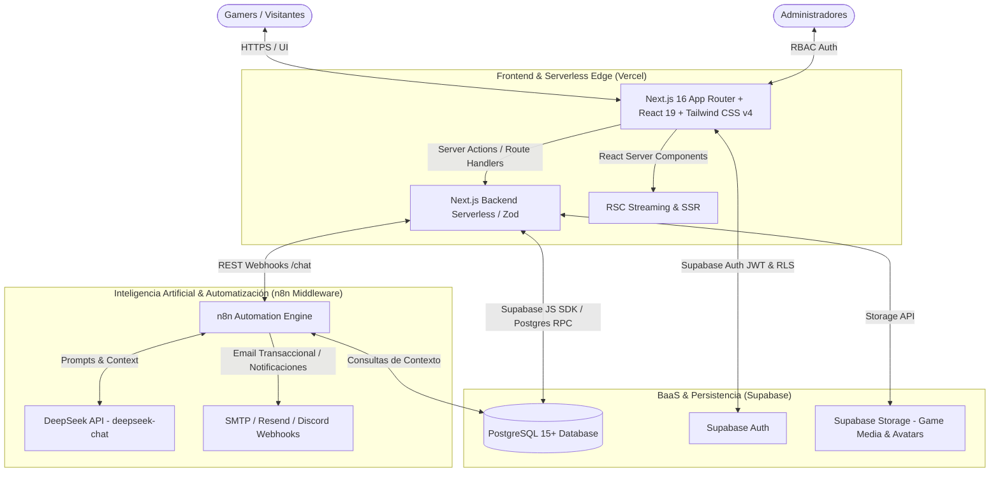

# 🎮 ViniGames — Master Technical Knowledge Base & Project Blueprint

> **Estado del Documento**: Activo / Fuente Única de Verdad (Single Source of Truth)  
> **Institución**: Universidad Tecnológica Privada de Santa Cruz (UTEPSA) — Facultad de Tecnología  
> **Carrera**: Ingeniería en Sistemas — *Desarrollo de Aplicaciones Web*  
> **Autores**: Vinicius Montibeller, Sergio Alvarez, Shaimme Zelada, Eduardo Ribera, Jose Alberto Rios  
> **Docente**: Ing. Bryana Ojopi Banegas  
> **Año**: 2026  

---

## 📌 1. Resumen Ejecutivo y Visión del Producto

**ViniGames** es una plataforma web moderna de comercio electrónico digital, descubrimiento asistido por Inteligencia Artificial y comunidad gamificada orientada a la industria de videojuegos para PC y consolas.

### Problema que Resuelve
En el mercado actual, los gamers se enfrentan a un ecosistema fragmentado: compran en tiendas tradicionales sin incentivos, consultan reseñas en foros externos sin validación de compra y carecen de recomendaciones verdaderamente personalizadas.

### Solución ViniGames
1. **Catálogo & Compra Digital Simulada**: Experiencia de e-commerce fluida con carrito reactivo, wishlist, descuentos automáticos y emisión instantánea de recibo transaccional.
2. **Biblioteca Interactiva**: Gestión de juegos adquiridos con contador de horas jugadas, estado de instalación y acceso a calificación.
3. **Comunidad & Reseñas Verificadas**: Sistema de reseñas exclusivo para compradores comprobados con votación comunitaria de utilidad (*Helpful / Not Helpful*).
4. **Motor de Gamificación Integral**:
   - **Gamer DNA**: Perfil analítico multidimensional (*Explorador, Competitivo, Narrativo, Coleccionista*).
   - **Rachas Diarias (Streaks)**: Calendario de conexiones consecutivas que premia el retorno del usuario.
   - **Niveles & Puntos de Experiencia (XP)**: Recompensas automáticas por actividades clave.
   - **Economía Virtual (GameCoins)**: Moneda interna acumulable para canjes y personalización.
   - **Medallas & Logros Desbloqueables**.
5. **Asistente Inteligente (ViniChat con DeepSeek & n8n)**:
   - Chatbot conversacional especializado que analiza el Gamer DNA del usuario y su biblioteca para recomendar títulos y resolver dudas de soporte.
   - Generación automatizada de resúmenes inteligentes de reseñas comunitarias.
6. **Panel Administrativo (ViniAdmin)**:
   - Métricas y KPIs en tiempo real (ingresos, usuarios activos, retención de rachas).
   - Gestión CRUD de catálogo de videojuegos, categorías y promociones.
   - Auditoría transaccional con exportación CSV.
   - Moderación de reseñas y supervisión de usuarios.

---

## 🏗️ 2. Arquitectura de Software y Stack Tecnológico



### Detalle del Stack
| Capa | Tecnología | Versión / Tipo | Rol y Justificación Técnica |
| :--- | :--- | :--- | :--- |
| **Frontend Framework** | **Next.js** | `16.3.0` (App Router) | SSR/SSG ultrarrápido, Server Components para SEO y rendimiento, Server Actions seguras. |
| **Librería de UI** | **React** | `19.2.8` | Interfaz reactiva, Actions concurrentes, hooks modernos (`useActionState`, `useOptimistic`). |
| **Estilos & Diseño** | **Tailwind CSS** | `v4.0` | Maquetación responsiva acelerada (Mobile-First), tema oscuro inmersivo (Dark Gamer Theme), cero bloat CSS. |
| **Iconografía e Interacción**| **Lucide React** | Última | Iconos consistentes y optimizados para interfaz gamer y panel administrativo. |
| **Validación de Datos** | **Zod** | `v3 / v4` | Validación estricta de esquemas tanto en cliente como en Server Actions antes de persistir. |
| **Base de Datos & Auth** | **Supabase** | BaaS Cloud (PostgreSQL 15+) | Autenticación con JWTs, políticas Row Level Security (RLS), base de datos relacional ACID y Supabase Storage para portadas y capturas. |
| **Motor de IA** | **DeepSeek API (deepseek-chat)** | LLM API | Procesamiento de lenguaje natural para ViniChat, recomendaciones personalizadas basadas en Gamer DNA y análisis de sentimiento en reseñas. |
| **Orquestador Webhooks** | **n8n** | Automation Engine | Intermediario central: recibe mensajes de chat vía webhook, consulta contexto en Supabase, invoca a DeepSeek y retorna la respuesta estructurada a la web. Además ejecuta tareas en segundo plano (recibos por correo, cálculo nocturno de rachas). |
| **Hosting & CI/CD** | **Vercel** | Edge Network | Despliegue global continuo de baja latencia con integración automática desde Git. |

---

## 🗄️ 3. Reingeniería Completa del Modelo de Base de Datos (PostgreSQL en Supabase)

### 3.1. Correcciones Críticas Frente al Modelo Anterior
1. **Integración Nativa con `auth.users`**: Se eliminó la gestión manual de contraseñas en texto plano/VARCHAR. La tabla `profiles` se vincula por clave foránea a `auth.users(id)` con eliminación en cascada.
2. **Relación Muchos a Muchos (N:M) en Videojuegos y Categorías**: Ahora un videojuego puede tener múltiples géneros (ej: *Acción + RPG + Aventura*) mediante la tabla intermedia `game_categories`.
3. **Modelo de Gamificación Completo**: Se incorporaron las entidades `achievements`, `user_achievements`, `streak_logs` y atributos de `gamer_dna` (porcentajes de Explorador, Competitivo, Narrativo, Coleccionista) y `gamecoins_balance` en `profiles`.
4. **Biblioteca de Juegos (`user_library`) con Atributos de Mockup**: Incluye `hours_played`, `install_status` (`NOT_INSTALLED`, `INSTALLING`, `INSTALLED`, `READY_TO_PLAY`) y `last_played_at`.
5. **ViniChat Asistente IA (`chat_sessions` y `chat_messages`)**: Almacenamiento estructurado de conversaciones por categoría temática.
6. **Votación de Reseñas (`review_votes`) con Restricción Única**: Previene votos duplicados por usuario.
7. **Auditoría de Administrador (`admin_audit_logs`)**: Registro histórico de acciones administrativas.

---

### 3.2. Script DDL Completo en PostgreSQL (Supabase Script)

```sql
-- ============================================================================
-- 1. EXTENSIONES Y ENUMS
-- ============================================================================
CREATE EXTENSION IF NOT EXISTS "uuid-ossp";

CREATE TYPE user_role AS ENUM ('VISITOR', 'USER', 'ADMIN');
CREATE TYPE install_status_type AS ENUM ('NOT_INSTALLED', 'INSTALLING', 'INSTALLED', 'READY_TO_PLAY');
CREATE TYPE order_status_type AS ENUM ('COMPLETED', 'PENDING', 'FAILED', 'CANCELLED');
CREATE TYPE payment_method_type AS ENUM ('SIMULATED_CARD', 'GAMECOINS', 'WALLET');
CREATE TYPE review_status_type AS ENUM ('APPROVED', 'PENDING', 'REJECTED');
CREATE TYPE achievement_category_type AS ENUM ('EXPLORATION', 'COMPETITIVE', 'COLLECTION', 'SOCIAL');
CREATE TYPE chat_sender_type AS ENUM ('USER', 'ASSISTANT', 'SYSTEM');

-- ============================================================================
-- 2. TABLA: profiles (Extensión de auth.users de Supabase)
-- ============================================================================
CREATE TABLE public.profiles (
    id UUID PRIMARY KEY REFERENCES auth.users(id) ON DELETE CASCADE,
    role user_role NOT NULL DEFAULT 'USER',
    username VARCHAR(50) UNIQUE NOT NULL,
    full_name VARCHAR(100),
    avatar_url TEXT DEFAULT '/avatars/default_ninja.png',
    bio TEXT,
    gamecoins_balance INTEGER NOT NULL DEFAULT 100 CHECK (gamecoins_balance >= 0),
    total_xp INTEGER NOT NULL DEFAULT 100 CHECK (total_xp >= 0),
    current_level INTEGER NOT NULL DEFAULT 1 CHECK (current_level >= 1),
    current_streak INTEGER NOT NULL DEFAULT 1 CHECK (current_streak >= 0),
    longest_streak INTEGER NOT NULL DEFAULT 1 CHECK (longest_streak >= 0),
    last_login_date DATE DEFAULT CURRENT_DATE,
    
    -- Gamer DNA (Porcentajes normalizados de estilo de juego)
    dna_exploration SMALLINT NOT NULL DEFAULT 25 CHECK (dna_exploration BETWEEN 0 AND 100),
    dna_competitive SMALLINT NOT NULL DEFAULT 25 CHECK (dna_competitive BETWEEN 0 AND 100),
    dna_narrative SMALLINT NOT NULL DEFAULT 25 CHECK (dna_narrative BETWEEN 0 AND 100),
    dna_collection SMALLINT NOT NULL DEFAULT 25 CHECK (dna_collection BETWEEN 0 AND 100),
    
    created_at TIMESTAMPTZ NOT NULL DEFAULT NOW(),
    updated_at TIMESTAMPTZ NOT NULL DEFAULT NOW()
);

-- ============================================================================
-- 3. TABLA: categories (Géneros y Categorías del Catálogo)
-- ============================================================================
CREATE TABLE public.categories (
    id SERIAL PRIMARY KEY,
    name VARCHAR(50) UNIQUE NOT NULL,
    slug VARCHAR(60) UNIQUE NOT NULL,
    description TEXT,
    icon_name VARCHAR(50),
    created_at TIMESTAMPTZ NOT NULL DEFAULT NOW()
);

-- ============================================================================
-- 4. TABLA: games (Catálogo de Videojuegos)
-- ============================================================================
CREATE TABLE public.games (
    id SERIAL PRIMARY KEY,
    title VARCHAR(150) NOT NULL,
    slug VARCHAR(180) UNIQUE NOT NULL,
    description TEXT NOT NULL,
    short_description VARCHAR(300),
    developer VARCHAR(100) NOT NULL,
    publisher VARCHAR(100),
    release_date DATE NOT NULL,
    base_price DECIMAL(10, 2) NOT NULL CHECK (base_price >= 0),
    discount_percent SMALLINT NOT NULL DEFAULT 0 CHECK (discount_percent BETWEEN 0 AND 100),
    final_price DECIMAL(10, 2) GENERATED ALWAYS AS (base_price * (1 - discount_percent / 100.0)) STORED,
    age_rating VARCHAR(10) DEFAULT '+13',
    cover_image_url TEXT NOT NULL,
    banner_image_url TEXT,
    trailer_url TEXT,
    is_featured BOOLEAN NOT NULL DEFAULT FALSE,
    is_active BOOLEAN NOT NULL DEFAULT TRUE,
    rating_avg DECIMAL(3, 2) NOT NULL DEFAULT 0.00 CHECK (rating_avg BETWEEN 0 AND 5),
    rating_count INTEGER NOT NULL DEFAULT 0 CHECK (rating_count >= 0),
    created_at TIMESTAMPTZ NOT NULL DEFAULT NOW(),
    updated_at TIMESTAMPTZ NOT NULL DEFAULT NOW()
);

-- ============================================================================
-- 5. TABLA: game_categories (Relación Muchos a Muchos)
-- ============================================================================
CREATE TABLE public.game_categories (
    game_id INTEGER NOT NULL REFERENCES public.games(id) ON DELETE CASCADE,
    category_id INTEGER NOT NULL REFERENCES public.categories(id) ON DELETE CASCADE,
    PRIMARY KEY (game_id, category_id)
);

-- ============================================================================
-- 6. TABLA: game_media (Galería de Capturas y Videos)
-- ============================================================================
CREATE TABLE public.game_media (
    id SERIAL PRIMARY KEY,
    game_id INTEGER NOT NULL REFERENCES public.games(id) ON DELETE CASCADE,
    media_type VARCHAR(20) NOT NULL CHECK (media_type IN ('IMAGE', 'VIDEO')),
    media_url TEXT NOT NULL,
    sort_order SMALLINT NOT NULL DEFAULT 0
);

-- ============================================================================
-- 7. TABLA: wishlists (Lista de Deseos)
-- ============================================================================
CREATE TABLE public.wishlists (
    id SERIAL PRIMARY KEY,
    user_id UUID NOT NULL REFERENCES public.profiles(id) ON DELETE CASCADE,
    game_id INTEGER NOT NULL REFERENCES public.games(id) ON DELETE CASCADE,
    created_at TIMESTAMPTZ NOT NULL DEFAULT NOW(),
    UNIQUE (user_id, game_id)
);

-- ============================================================================
-- 8. TABLA: cart_items (Carrito de Compras)
-- ============================================================================
CREATE TABLE public.cart_items (
    id SERIAL PRIMARY KEY,
    user_id UUID NOT NULL REFERENCES public.profiles(id) ON DELETE CASCADE,
    game_id INTEGER NOT NULL REFERENCES public.games(id) ON DELETE CASCADE,
    created_at TIMESTAMPTZ NOT NULL DEFAULT NOW(),
    UNIQUE (user_id, game_id)
);

-- ============================================================================
-- 9. TABLA: orders (Cabecera de Compras y Transacciones)
-- ============================================================================
CREATE TABLE public.orders (
    id SERIAL PRIMARY KEY,
    order_code VARCHAR(30) UNIQUE NOT NULL, -- ej: TX-9401
    user_id UUID NOT NULL REFERENCES public.profiles(id) ON DELETE RESTRICT,
    subtotal DECIMAL(10, 2) NOT NULL CHECK (subtotal >= 0),
    discount_total DECIMAL(10, 2) NOT NULL DEFAULT 0.00 CHECK (discount_total >= 0),
    total DECIMAL(10, 2) NOT NULL CHECK (total >= 0),
    payment_method payment_method_type NOT NULL DEFAULT 'SIMULATED_CARD',
    status order_status_type NOT NULL DEFAULT 'COMPLETED',
    receipt_pdf_url TEXT,
    created_at TIMESTAMPTZ NOT NULL DEFAULT NOW()
);

-- ============================================================================
-- 10. TABLA: order_items (Detalle de Compra)
-- ============================================================================
CREATE TABLE public.order_items (
    id SERIAL PRIMARY KEY,
    order_id INTEGER NOT NULL REFERENCES public.orders(id) ON DELETE CASCADE,
    game_id INTEGER NOT NULL REFERENCES public.games(id) ON DELETE RESTRICT,
    unit_price DECIMAL(10, 2) NOT NULL,
    discount_applied SMALLINT NOT NULL DEFAULT 0,
    final_price DECIMAL(10, 2) NOT NULL,
    UNIQUE (order_id, game_id)
);

-- ============================================================================
-- 11. TABLA: user_library (Biblioteca de Videojuegos Adquiridos)
-- ============================================================================
CREATE TABLE public.user_library (
    id SERIAL PRIMARY KEY,
    user_id UUID NOT NULL REFERENCES public.profiles(id) ON DELETE CASCADE,
    game_id INTEGER NOT NULL REFERENCES public.games(id) ON DELETE RESTRICT,
    order_id INTEGER REFERENCES public.orders(id) ON DELETE SET NULL,
    install_status install_status_type NOT NULL DEFAULT 'NOT_INSTALLED',
    hours_played DECIMAL(6, 1) NOT NULL DEFAULT 0.0 CHECK (hours_played >= 0),
    last_played_at TIMESTAMPTZ,
    acquired_at TIMESTAMPTZ NOT NULL DEFAULT NOW(),
    UNIQUE (user_id, game_id)
);

-- ============================================================================
-- 12. TABLA: reviews (Reseñas y Calificaciones Comunitarias)
-- ============================================================================
CREATE TABLE public.reviews (
    id SERIAL PRIMARY KEY,
    user_id UUID NOT NULL REFERENCES public.profiles(id) ON DELETE CASCADE,
    game_id INTEGER NOT NULL REFERENCES public.games(id) ON DELETE CASCADE,
    rating SMALLINT NOT NULL CHECK (rating BETWEEN 1 AND 5),
    title VARCHAR(100),
    content TEXT NOT NULL,
    is_verified_purchase BOOLEAN NOT NULL DEFAULT TRUE,
    helpful_votes_count INTEGER NOT NULL DEFAULT 0 CHECK (helpful_votes_count >= 0),
    unhelpful_votes_count INTEGER NOT NULL DEFAULT 0 CHECK (unhelpful_votes_count >= 0),
    status review_status_type NOT NULL DEFAULT 'APPROVED',
    created_at TIMESTAMPTZ NOT NULL DEFAULT NOW(),
    updated_at TIMESTAMPTZ NOT NULL DEFAULT NOW(),
    UNIQUE (user_id, game_id)
);

-- ============================================================================
-- 13. TABLA: review_votes (Votos de Utilidad de Reseñas)
-- ============================================================================
CREATE TABLE public.review_votes (
    id SERIAL PRIMARY KEY,
    review_id INTEGER NOT NULL REFERENCES public.reviews(id) ON DELETE CASCADE,
    user_id UUID NOT NULL REFERENCES public.profiles(id) ON DELETE CASCADE,
    is_helpful BOOLEAN NOT NULL DEFAULT TRUE,
    created_at TIMESTAMPTZ NOT NULL DEFAULT NOW(),
    UNIQUE (review_id, user_id)
);

-- ============================================================================
-- 14. TABLA: discounts (Gestión de Promociones Temporales)
-- ============================================================================
CREATE TABLE public.discounts (
    id SERIAL PRIMARY KEY,
    game_id INTEGER NOT NULL REFERENCES public.games(id) ON DELETE CASCADE,
    code VARCHAR(50),
    discount_percent SMALLINT NOT NULL CHECK (discount_percent BETWEEN 1 AND 99),
    start_date TIMESTAMPTZ NOT NULL,
    end_date TIMESTAMPTZ NOT NULL,
    is_active BOOLEAN NOT NULL DEFAULT TRUE,
    created_at TIMESTAMPTZ NOT NULL DEFAULT NOW(),
    CHECK (end_date > start_date)
);

-- ============================================================================
-- 15. TABLA: streak_logs (Historial de Rachas y Conexión Diaria)
-- ============================================================================
CREATE TABLE public.streak_logs (
    id SERIAL PRIMARY KEY,
    user_id UUID NOT NULL REFERENCES public.profiles(id) ON DELETE CASCADE,
    activity_date DATE NOT NULL DEFAULT CURRENT_DATE,
    streak_count INTEGER NOT NULL CHECK (streak_count >= 1),
    xp_awarded INTEGER NOT NULL DEFAULT 20,
    created_at TIMESTAMPTZ NOT NULL DEFAULT NOW(),
    UNIQUE (user_id, activity_date)
);

-- ============================================================================
-- 16. TABLA: achievements (Catálogo de Medallas y Logros de Gamificación)
-- ============================================================================
CREATE TABLE public.achievements (
    id SERIAL PRIMARY KEY,
    code VARCHAR(50) UNIQUE NOT NULL, -- ej: 'EPIC_EXPLORER', 'SHADOW_HUNTER'
    title VARCHAR(100) NOT NULL,
    description TEXT NOT NULL,
    category achievement_category_type NOT NULL DEFAULT 'EXPLORATION',
    icon_name VARCHAR(50) NOT NULL DEFAULT 'Trophy',
    xp_reward INTEGER NOT NULL DEFAULT 100 CHECK (xp_reward >= 0),
    gamecoins_reward INTEGER NOT NULL DEFAULT 50 CHECK (gamecoins_reward >= 0),
    created_at TIMESTAMPTZ NOT NULL DEFAULT NOW()
);

-- ============================================================================
-- 17. TABLA: user_achievements (Logros Desbloqueados por Usuario)
-- ============================================================================
CREATE TABLE public.user_achievements (
    id SERIAL PRIMARY KEY,
    user_id UUID NOT NULL REFERENCES public.profiles(id) ON DELETE CASCADE,
    achievement_id INTEGER NOT NULL REFERENCES public.achievements(id) ON DELETE CASCADE,
    unlocked_at TIMESTAMPTZ NOT NULL DEFAULT NOW(),
    UNIQUE (user_id, achievement_id)
);

-- ============================================================================
-- 18. TABLA: chat_sessions (Sesiones de Soporte e IA ViniChat)
-- ============================================================================
CREATE TABLE public.chat_sessions (
    id UUID PRIMARY KEY DEFAULT uuid_generate_v4(),
    user_id UUID NOT NULL REFERENCES public.profiles(id) ON DELETE CASCADE,
    title VARCHAR(120) NOT NULL DEFAULT 'Nueva Consulta',
    topic_category VARCHAR(50) DEFAULT 'GENERAL', -- ej: RPG_RECOMMENDATION, ORDER_STATUS, INSTALL_ISSUE
    is_active BOOLEAN NOT NULL DEFAULT TRUE,
    created_at TIMESTAMPTZ NOT NULL DEFAULT NOW(),
    updated_at TIMESTAMPTZ NOT NULL DEFAULT NOW()
);

-- ============================================================================
-- 19. TABLA: chat_messages (Mensajes del Asistente Virtual)
-- ============================================================================
CREATE TABLE public.chat_messages (
    id SERIAL PRIMARY KEY,
    session_id UUID NOT NULL REFERENCES public.chat_sessions(id) ON DELETE CASCADE,
    sender chat_sender_type NOT NULL DEFAULT 'USER',
    content TEXT NOT NULL,
    metadata_json JSONB, -- Contiene IDs de juegos recomendados o enlaces de compra
    created_at TIMESTAMPTZ NOT NULL DEFAULT NOW()
);

-- ============================================================================
-- 20. TABLA: admin_audit_logs (Auditoría Administrativa)
-- ============================================================================
CREATE TABLE public.admin_audit_logs (
    id SERIAL PRIMARY KEY,
    admin_id UUID NOT NULL REFERENCES public.profiles(id) ON DELETE RESTRICT,
    action_type VARCHAR(50) NOT NULL, -- ej: 'CREATE_GAME', 'BAN_USER', 'DELETE_REVIEW'
    entity_name VARCHAR(50) NOT NULL,
    entity_id VARCHAR(50) NOT NULL,
    details JSONB,
    ip_address VARCHAR(45),
    created_at TIMESTAMPTZ NOT NULL DEFAULT NOW()
);

-- ============================================================================
-- 21. ÍNDICES PARA OPTIMIZACIÓN DE RENDIMIENTO
-- ============================================================================
CREATE INDEX idx_games_slug ON public.games(slug);
CREATE INDEX idx_games_is_featured ON public.games(is_featured) WHERE is_featured = TRUE;
CREATE INDEX idx_games_is_active ON public.games(is_active) WHERE is_active = TRUE;
CREATE INDEX idx_reviews_game_id ON public.reviews(game_id);
CREATE INDEX idx_orders_user_id ON public.orders(user_id);
CREATE INDEX idx_user_library_user_id ON public.user_library(user_id);
CREATE INDEX idx_chat_messages_session ON public.chat_messages(session_id);

-- ============================================================================
-- 22. POLÍTICAS DE ROW LEVEL SECURITY (RLS)
-- ============================================================================
ALTER TABLE public.profiles ENABLE ROW LEVEL SECURITY;
ALTER TABLE public.games ENABLE ROW LEVEL SECURITY;
ALTER TABLE public.categories ENABLE ROW LEVEL SECURITY;
ALTER TABLE public.game_categories ENABLE ROW LEVEL SECURITY;
ALTER TABLE public.game_media ENABLE ROW LEVEL SECURITY;
ALTER TABLE public.wishlists ENABLE ROW LEVEL SECURITY;
ALTER TABLE public.cart_items ENABLE ROW LEVEL SECURITY;
ALTER TABLE public.orders ENABLE ROW LEVEL SECURITY;
ALTER TABLE public.order_items ENABLE ROW LEVEL SECURITY;
ALTER TABLE public.user_library ENABLE ROW LEVEL SECURITY;
ALTER TABLE public.reviews ENABLE ROW LEVEL SECURITY;
ALTER TABLE public.review_votes ENABLE ROW LEVEL SECURITY;
ALTER TABLE public.discounts ENABLE ROW LEVEL SECURITY;
ALTER TABLE public.streak_logs ENABLE ROW LEVEL SECURITY;
ALTER TABLE public.achievements ENABLE ROW LEVEL SECURITY;
ALTER TABLE public.user_achievements ENABLE ROW LEVEL SECURITY;
ALTER TABLE public.chat_sessions ENABLE ROW LEVEL SECURITY;
ALTER TABLE public.chat_messages ENABLE ROW LEVEL SECURITY;
ALTER TABLE public.admin_audit_logs ENABLE ROW LEVEL SECURITY;

-- Reglas Públicas de Lectura (Catálogo)
CREATE POLICY "Catálogo público visible para todos" ON public.games FOR SELECT USING (is_active = true);
CREATE POLICY "Categorías visibles para todos" ON public.categories FOR SELECT USING (true);
CREATE POLICY "Medios de juego visibles para todos" ON public.game_media FOR SELECT USING (true);
CREATE POLICY "Reseñas aprobadas visibles para todos" ON public.reviews FOR SELECT USING (status = 'APPROVED');
CREATE POLICY "Perfiles públicos lectura básica" ON public.profiles FOR SELECT USING (true);

-- Reglas Propias de Usuario (Datos Privados)
CREATE POLICY "Usuarios gestionan su propio perfil" ON public.profiles FOR ALL USING (auth.uid() = id);
CREATE POLICY "Usuarios gestionan su propia wishlist" ON public.wishlists FOR ALL USING (auth.uid() = user_id);
CREATE POLICY "Usuarios gestionan su propio carrito" ON public.cart_items FOR ALL USING (auth.uid() = user_id);
CREATE POLICY "Usuarios ven sus propias órdenes" ON public.orders FOR SELECT USING (auth.uid() = user_id);
CREATE POLICY "Usuarios ven su propia biblioteca" ON public.user_library FOR SELECT USING (auth.uid() = user_id);
CREATE POLICY "Usuarios gestionan sus chats" ON public.chat_sessions FOR ALL USING (auth.uid() = user_id);
CREATE POLICY "Usuarios ven sus mensajes de chat" ON public.chat_messages FOR ALL 
    USING (session_id IN (SELECT id FROM public.chat_sessions WHERE user_id = auth.uid()));

-- Reglas de Administrador
CREATE POLICY "Admins control total de juegos" ON public.games FOR ALL 
    USING (EXISTS (SELECT 1 FROM public.profiles WHERE id = auth.uid() AND role = 'ADMIN'));
CREATE POLICY "Admins control total de órdenes" ON public.orders FOR ALL 
    USING (EXISTS (SELECT 1 FROM public.profiles WHERE id = auth.uid() AND role = 'ADMIN'));
CREATE POLICY "Admins control total de reseñas" ON public.reviews FOR ALL 
    USING (EXISTS (SELECT 1 FROM public.profiles WHERE id = auth.uid() AND role = 'ADMIN'));
```

---

## ⚙️ 4. Descripción Técnica e Integración de n8n

En el informe técnico y en la arquitectura del sistema, la herramienta **n8n** cumple el rol de **Motor de Orquestación y Automatización Asíncrona de Flujos de Trabajo**.

### 4.1. Justificación Técnica para el Informe
> **n8n (Workflow Automation Engine)**: Plataforma de integración y orquestación de flujos de trabajo basada en eventos y nodos programables. En ViniGames, n8n actúa como la capa de servicios desacoplada para tareas en segundo plano que no deben bloquear el hilo de ejecución de la interfaz web, integrando la API de DeepSeek con Supabase y servicios de mensajería externa.

### 4.2. Flujos Automatizados en ViniGames con n8n
1. **Webhook de Compra y Generación de Recibo Digital**:
   - **Disparador**: Next.js Server Action emite un evento webhook tras confirmar la orden `TX-XXXX`.
   - **Proceso n8n**: Formatea el recibo digital con los metadatos de los juegos adquiridos, calcula los puntos XP ganados (+100 XP por compra) y actualiza el saldo en Supabase.
   - **Salida**: Notificación al usuario y guardado de comprobante.
2. **Orquestación de ViniChat con DeepSeek (Middleware n8n)**:
   - **Disparador**: Mensaje entrante del usuario en la interfaz `/chat` de Next.js enviado vía Webhook HTTP a n8n.
   - **Proceso n8n**:
     1. Recibe el payload `{ user_id, message, session_id }`.
     2. Nodo Supabase/PostgreSQL consulta el Gamer DNA del usuario, juegos en biblioteca y últimos títulos del catálogo.
     3. Nodo HTTP / DeepSeek envía el prompt contextualizado al modelo `deepseek-chat`.
     4. Nodo de formateo estructura la respuesta en JSON con texto en Markdown y tarjetas de juegos recomendados (`recommended_game_ids`).
   - **Salida**: Respuesta sincrónica al webhook que Next.js renderiza inmediatamente en el chat.
3. **Cron Job Nocturno de Rachas Diarias y Gamificación**:
   - **Disparador**: Cron trigger programado diariamente a las 00:00 UTC.
   - **Proceso n8n**: Evalúa usuarios inactivos por más de 48 horas para reiniciar `current_streak` a 0 e identifica jugadores con 7 días continuos para desbloquear la medalla `SEVEN_DAY_WARRIOR`.
4. **Moderación Asistida de Reseñas por IA**:
   - **Disparador**: Inserción de nueva reseña en la tabla `reviews`.
   - **Proceso n8n**: DeepSeek analiza el texto para detectar toxicidad, lenguaje inapropiado o spam. Si el puntaje de toxicidad es bajo, aprueba automáticamente (`status = 'APPROVED'`), de lo contrario envía una alerta al canal administrativo.

---

## 🎨 5. Mapeo de Pantallas del Prototipo Figma & Experiencia de Usuario

A partir del diseño del sistema y los mockups del informe, se identifican las 15 pantallas y vistas principales:

| Nro | Pantalla / Vista | Ruta Sugerida | Componentes Clave | Interacciones y Estado |
| :--- | :--- | :--- | :--- | :--- |
| **01** | **Inicio de Sesión** | `/login` | Formulario con email/password, fondo Cyber Gamer, botón Supabase Auth, enlace a registro. | Validación con Zod, manejo de errores de credenciales, redirección según rol. |
| **02** | **Onboarding Paso 1: Identidad Gamer** | `/onboarding/step-1` | Selector interactivo de Avatar (Ninja, Cyber, Mech, Mago), Input `username`. | Validación de disponibilidad de username en tiempo real. |
| **03** | **Onboarding Paso 2: Géneros Favoritos** | `/onboarding/step-2` | Grid de categorías (RPG, Acción, Carreras, Terror, Indie, Deportes, Aventura, Estrategia). | Selección múltiple reactiva con contador de seleccionados. |
| **04** | **Onboarding Paso 3: Gamer DNA** | `/onboarding/step-3` | 4 Tarjetas de arquetipo (*Explorador, Competitivo, Narrativo, Coleccionista*). | Asignación de pesos porcentuales al perfil analítico. |
| **05** | **Onboarding Paso 4: Credenciales** | `/onboarding/step-4` | Email, password, confirmación y aceptación de términos. | Creación en `auth.users` y vinculación en `profiles`. |
| **06** | **Bienvenida Gamer (¡Misión Completada!)**| `/onboarding/welcome` | Modal/Card festivo con avatar, Nivel 1 (Novato), +100 XP acreditados. | Animación de confeti/glow y redirección al `/home`. |
| **07** | **Página Principal (Home)** | `/` o `/home` | Hero Banner destacado (*Neon Odyssey*), Carrusel de ofertas, Grid "Recomendados para ti (Gamer DNA)", Widget "Mantén tu Racha". | Fetching dinámico con SSR y revalidación de caché. |
| **08** | **ViniChat Asistente IA** | `/chat` | Sidebar de conversaciones temáticas (Recomendación RPG, Estado de Pedido, etc.), ventana de chat con Markdown y Cards interactivas de juegos recomendados. | Orquestación mediante Webhook de n8n hacia DeepSeek API, renderizado de tarjetas interactivas de compra. |
| **09** | **Dashboard Admin: Métricas & KPIs** | `/admin` | Tarjetas de KPI (Ventas Bs., Usuarios Activos, Juegos Publicados, % Retención Rachas), Gráfica de transacciones y tabla de últimas compras. | Server Components con acceso protegido por RLS (rol `ADMIN`). |
| **10** | **Admin: Registros de Ventas** | `/admin/ventas` | Tabla con filtros de estado (*Completado, Pendiente, Fallido*), selector de rango de fechas y exportación CSV. | Paginación en servidor y filtrado reactivo. |
| **11** | **Biblioteca de Videojuegos** | `/library` | Grid con portadas de juegos adquiridos, barra de progreso de logros, contador de horas jugadas y botón interactivo "Jugar / Instalar". | Filtros: *Todos, Instalados, Recientes*. |
| **12** | **Lista de Deseos (Wishlist)** | `/wishlist` | Lista de juegos favoritos, alerta de descuento activo, botón "Añadir al carrito" y botón "Eliminar". | Actualizaciones optimistas con React 19. |
| **13** | **Panel de Rachas, Niveles y Logros** | `/gamification` | Calendario de 7 días con estados completados, barra de progreso XP, tabs de medallas (*Exploración, Colección, Social*) con candados. | Cálculo dinámico de progreso hacia el siguiente nivel. |
| **14** | **Perfil Gamer & Estadísticas** | `/profile` | Tarjeta de usuario con Avatar, Nivel, Badge de Racha, Saldo GameCoins, gráfico de barras de Gamer DNA y lista de juegos recientes. | Edición de avatar y biografía en modal. |
| **15** | **Ficha de Detalle de Videojuego** | `/games/[slug]` | Portada widescreen, galería multimedia/trailer, precio con % descuento, botón "Comprar / Al Carrito", resumen IA de reseñas y feed de reseñas comunitarias con votación de utilidad. | Validación de si el usuario posee el juego antes de permitir publicar reseña. |

---

## 🎯 6. Motor de Gamificación y Fórmulas Matemáticas

### 6.1. Progresión de Niveles por Puntos de Experiencia (XP)
El nivel del jugador se calcula mediante una función exponencial suave:
$$\text{XP Requerido para Nivel } N = 100 \times N^{1.5}$$

- **Nivel 1 (Novato)**: 0 – 100 XP
- **Nivel 2 (Aprendiz)**: 101 – 282 XP
- **Nivel 5 (Aventurero)**: ~1,118 XP
- **Nivel 12 (Explorador Épico)**: ~4,156 XP

### 6.2. Matriz de Recompensas de XP y GameCoins
- **Registro y Onboarding completado (4 pasos obligatorios)**: $+100 \text{ XP}$ y $+100 \text{ GameCoins}$
- **Conexión diaria (Racha)**: $+20 \text{ XP}$ base ($+50 \text{ XP}$ bono al alcanzar racha de 7 días)
- **Compra de videojuego (Simulada con tarjeta de prueba)**: $+100 \text{ XP}$ por título
- **Publicación de reseña verificada**: $+50 \text{ XP}$ y $+25 \text{ GameCoins}$
- **Reseña marcada como muy útil (+5 votos)**: $+30 \text{ XP}$
- **Uso de GameCoins**: Economía virtual reservada exclusivamente para desbloqueo de avatares especiales, títulos cosméticos y personalización de perfil.

---

## 🤖 7. Integración de Inteligencia Artificial (DeepSeek + n8n Middleware)

El módulo **ViniChat** opera con el siguiente flujo desacoplado:
1. **Next.js Web Client** $\to$ Envía solicitud POST al Webhook expuesto por **n8n** (`/webhook/vinichat`).
2. **n8n Workflow**:
   - Valida el token del usuario.
   - Ejecuta consulta en **Supabase** para obtener:
     * Gamer DNA (`dna_exploration`, `dna_competitive`, `dna_narrative`, `dna_collection`).
     * Títulos ya adquiridos en `user_library` (para no recomendarlos de nuevo).
     * Catálogo disponible en `games`.
   - Inyecta el contexto en un System Prompt especializado y llama a la API de **DeepSeek** (`deepseek-chat`).
   - Parsea la respuesta del LLM a un esquema JSON enriquecido con `message` (Markdown) y `recommended_game_ids` (array de IDs para renderizar tarjetas interactivas de compra).
3. **Next.js Web Client** $\to$ Renderiza el mensaje y las mini-fichas interactivas con botón directo para añadir al carrito.

---

## 🌱 8. Script de Inicialización y Seeding de Datos (PostgreSQL)

```sql
-- Categorías Base
INSERT INTO public.categories (name, slug, description, icon_name) VALUES
('Acción', 'accion', 'Juegos de combate rápido, reflejos y adrenalina.', 'Sword'),
('RPG', 'rpg', 'Juegos de rol con progresión profunda de personajes.', 'Shield'),
('Aventura', 'aventura', 'Exploración de mundos inmersivos y narrativa.', 'Compass'),
('Estrategia', 'estrategia', 'Tácticas en tiempo real y por turnos.', 'Brain'),
('Indie', 'indie', 'Obras creativas de estudios independientes.', 'Sparkles'),
('Terror', 'terror', 'Experiencias de suspenso, horror psicológico y supervivencia.', 'Ghost'),
('Carreras', 'carreras', 'Velocidad en pista, simulación y arcade.', 'Car'),
('Deportes', 'deportes', 'Simuladores y competencias deportivas.', 'Trophy')
ON CONFLICT (slug) DO NOTHING;

-- Logros / Medallas Iniciales
INSERT INTO public.achievements (code, title, description, category, icon_name, xp_reward, gamecoins_reward) VALUES
('WELCOME_ROOKIE', '¡Misión Completada!', 'Completaste el onboarding y creaste tu identidad gamer.', 'SOCIAL', 'Award', 100, 100),
('EPIC_EXPLORER', 'Explorador Épico', 'Explora más de 50 títulos dentro del catálogo interactivo.', 'EXPLORATION', 'Compass', 250, 50),
('SHADOW_HUNTER', 'Cazador de Sombras', 'Derrota 10 misiones y desafíos comunitarios.', 'COMPETITIVE', 'Crosshair', 400, 100),
('PURE_COLLECTOR', 'Coleccionista Puro', 'Adquiere 5 títulos y manténlos en tu biblioteca.', 'COLLECTION', 'Layers', 500, 150),
('SEVEN_DAY_STREAK', 'Racha Legendaria', 'Mantén una racha de conexión diaria de 7 días seguidos.', 'SOCIAL', 'Flame', 300, 75)
ON CONFLICT (code) DO NOTHING;
```

---

## 🛡️ 9. Estándares de Código y Directrices de Desarrollo

1. **Next.js 16 & React 19 Standards**:
   - Usar Server Components por defecto en `app/`.
   - Utilizar `'use client'` solo en componentes con interactividad de usuario (formularios, carritos, modales, chat).
   - Manejar mutaciones de datos mediante **Server Actions** ubicadas en `app/actions/`.
2. **Seguridad & Acceso**:
   - Validar todos los inputs con esquemas **Zod** antes de ejecutar operaciones en la base de datos.
   - Proteger rutas administrativas en `middleware.ts` y verificar el rol `ADMIN` dentro de las Server Actions.
3. **Diseño Visual**:
   - Paleta de color base: Tema oscuro inmersivo (`bg-zinc-950`, `bg-zinc-900`, `border-zinc-800`), acentos púrpura/violeta neón (`text-purple-400`, `bg-purple-600`, `hover:bg-purple-500`) y cian/azul para estados activos.
   - Tipografía: Sans-serif geométrica legible (Geist / Inter).

